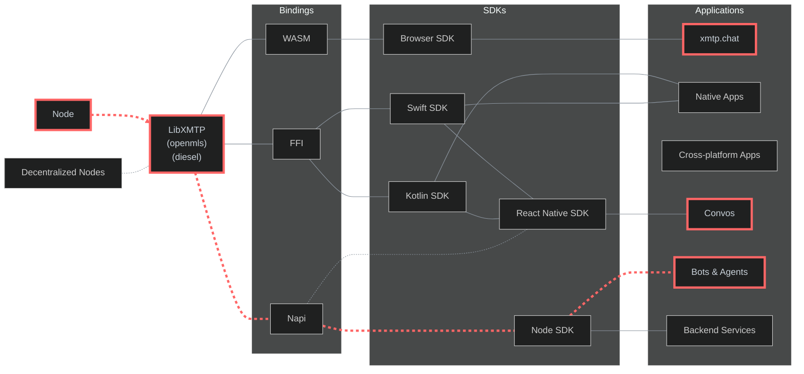

# XMTP QA Testing

## Automated workflows

| Test suite      | Status                                                                                                                                                                            | Workflow                                                                                 | Run frequency | Networks            | Test                                                                                 |
| --------------- | --------------------------------------------------------------------------------------------------------------------------------------------------------------------------------- | ---------------------------------------------------------------------------------------- | ------------- | ------------------- | ------------------------------------------------------------------------------------ |
| 🚀 Performance  | [](https://github.com/xmtp/xmtp-qa-testing/actions/workflows/TS_Performance.yml) | [Workflow](https://github.com/xmtp/xmtp-qa-testing/actions/workflows/TS_Performance.yml) | Every 30 min  | `dev`, `production` | [Test code](https://github.com/xmtp/xmtp-qa-testing/tree/main/suites/TS_Performance) |
| 📬 Delivery     | [](https://github.com/xmtp/xmtp-qa-testing/actions/workflows/TS_Delivery.yml)       | [Workflow](https://github.com/xmtp/xmtp-qa-testing/actions/workflows/TS_Delivery.yml)    | Every 30 min  | `dev`, `production` | [Test code](https://github.com/xmtp/xmtp-qa-testing/tree/main/suites/TS_Delivery)    |
| 👋 Gm           | [](https://github.com/xmtp/xmtp-qa-testing/actions/workflows/TS_Gm.yml)                   | [Workflow](https://github.com/xmtp/xmtp-qa-testing/actions/workflows/TS_Gm.yml)          | Every 30 min  | `dev`, `production` | [Test code](https://github.com/xmtp/xmtp-qa-testing/tree/main/suites/TS_Gm)          |
| ⏳ Groups       | [](https://github.com/xmtp/xmtp-qa-testing/actions/workflows/TS_Large.yml)             | [Workflow](https://github.com/xmtp/xmtp-qa-testing/actions/workflows/TS_Large.yml)       | Every 2 hours | `production`        | [Test code](https://github.com/xmtp/xmtp-qa-testing/tree/main/suites/TS_Large)       |
| 🚑 Agent health | [](https://github.com/xmtp/xmtp-qa-testing/actions/workflows/TS_AgentHealth.yml) | [Workflow](https://github.com/xmtp/xmtp-qa-testing/actions/workflows/TS_AgentHealth.yml) | Every 30 min  | `dev`, `production` | [Test code](https://github.com/xmtp/xmtp-qa-testing/tree/main/suites/TS_AgentHealth) |

## Testing scope

This monorepo contains a comprehensive collection of tools for testing and monitoring the XMTP protocol and its implementations.

### Architecture

This flowchart illustrates the XMTP protocol's layered architecture and testing scope:



> The highlighted path (red dashed line) in the architecture diagram shows our main testing focus.

`LibXMTP` is a shared library built in Rust and compiled to WASM, Napi, and FFI bindings. It encapsulates the core cryptography functions of the XMTP messaging protocol. Due to the complexity of the protocol, we are using `openmls` as the underlying cryptographic library, it's important to test how this bindings perform in their own language environments.

We can test all XMTP bindings using three main applications. We use [xmtp.chat](https://xmtp.chat/) to test the Browser SDK's Wasm binding in actual web environments. We use [Convos](https://github.com/ephemeraHQ/converse-app) to test the React Native SDK, which uses both Swift and Kotlin FFI bindings for mobile devices. We use [agents](https://github.com/ephemeraHQ/xmtp-agent-examples) to test the Node SDK's Napi binding for server functions. This testing method checks the entire protocol across all binding types, making sure different clients work together, messages are saved, and users have the same experience across the XMTP system.

### Testing details

> Baseline is `us-east` region and `production` network.

- Multi-region testing nodes (`us-east`, `us-west` , `asia`, `europe` )
- 30-minute automated test execution intervals
- Comprehensive data aggregation in datadog
- All measurements are in `milliseconds`
- Testing directly on top of SDKs for real-world scenarios
- `dev` and `production` network covered
- Automated testing for web app `xmtp.chat`
- Manual testing for react native apps
- Simulated agent testing for real-world simulations

### TLDR: Metrics

- **Core SDK Performance**: Direct message creation (<500), group operations (<200-500)
- **Network Performance**: Server call (<100), TLS handshake (<100), total processing (<300)
- **Group Scaling**: Supports up to 300 members efficiently (create: 9s, operations: <350)
- **Regional Performance**: US/Europe optimal, Asia/South America higher latency (+46-160%)
- **Message Reliability**: 100% delivery rate (target: 99.9%), perfect ordering
- **Environments**: Production consistently outperfor Dev network by 5-9%

## Operation performance

### Core SDK Operations Performance

| Operation                | Description                            | Avg | Target | Status                 |
| ------------------------ | -------------------------------------- | --- | ------ | ---------------------- |
| clientCreate             | Creating a client                      | 588 | <350   | ⚠️ Performance Concern |
| inboxState               | Checking inbox state                   | 41  | <350   | ✅ On Target           |
| newDm                    | Creating a direct message conversation | 258 | <350   | ✅ On Target           |
| newDmWithIdentifiers     | Creating a dm by address               | 294 | <350   | ✅ On Target           |
| sendGM                   | Sending a group message                | 126 | <200   | ✅ On Target           |
| receiveGM                | Receiving a group message              | 87  | <200   | ✅ On Target           |
| createGroup              | Creating a group                       | 315 | <350   | ✅ On Target           |
| createGroupByIdentifiers | Creating a group by address            | 313 | <350   | ✅ On Target           |
| syncGroup                | Syncing group state                    | 76  | <200   | ✅ On Target           |
| updateGroupName          | Updating group metadata                | 129 | <200   | ✅ On Target           |
| removeMembers            | Removing participants from a group     | 127 | <250   | ✅ On Target           |
| sendGroupMessage         | Sending a group message                | 85  | <200   | ✅ On Target           |
| receiveGroupMessage      | Processing group message strea         | 124 | <200   | ✅ On Target           |

### Group operations performance

#### Sender-Side average performance

| Size | Send message | Update name | Remove members | Create | Status                 |
| ---- | ------------ | ----------- | -------------- | ------ | ---------------------- |
| 50   | 86           | 135         | 139            | 1329   | ✅ On Target           |
| 100  | 88           | 145         | 157            | 1522   | ✅ On Target           |
| 150  | 95           | 203         | 190            | 2306   | ✅ On Target           |
| 200  | 93           | 193         | 205            | 3344   | ✅ On Target           |
| 250  | 108          | 219         | 237            | 4276   | ⚠️ Performance Concern |
| 300  | 97           | 244         | 247            | 5463   | ⚠️ Performance Concern |
| 350  | 101          | 264         | 308            | 6641   | ⚠️ Performance Concern |
| 400  | 111          | 280         | 320            | 7641   | ⚠️ Performance Concern |

_Note: This measurments are taken only from the sender side and after the group is created._

#### Receiver-Side stream performance

| Group Size | New Members | Metadata | Messages | Status                 |
| ---------- | ----------- | -------- | -------- | ---------------------- |
| 50         | 687         | 141      | 131      | ✅ On Target           |
| 100        | 746         | 155      | 117      | ✅ On Target           |
| 150        | 833         | 163      | 147      | ✅ On Target           |
| 200        | 953         | 179      | 173      | ✅ On Target           |
| 250        | 1007        | 187      | 161      | ⚠️ Performance Concern |
| 300        | 1040        | 195      | 167      | ⚠️ Performance Concern |
| 350        | 1042        | 198      | 178      | ⚠️ Performance Concern |
| 400        | 1192        | 214      | 173      | ⚠️ Performance Concern |

_Note: This measurments are taken only from the receiver side and after the group is created. The stream is measured as the first message received._

#### Receiver-Side sync performance

| Size | syncAll | sync | CumulativeSyncAll | CumulativeSync | Status                 |
| ---- | ------- | ---- | ----------------- | -------------- | ---------------------- |
| 50   | 366     | 291  | 482               | 266            | ✅ On Target           |
| 100  | 503     | 424  | 521               | 372            | ✅ On Target           |
| 150  | 665     | 522  | 727               | 622            | ✅ On Target           |
| 200  | 854     | 653  | 1066              | 936            | ✅ On Target           |
| 250  | 966     | 768  | 1582              | 1148           | ⚠️ Performance Concern |
| 300  | 1225    | 861  | 1619              | 1362           | ⚠️ Performance Concern |
| 350  | 1322    | 1218 | 1846              | 2017           | ⚠️ Performance Concern |
| 400  | 1292    | 1325 | 2082              | 1792           | ⚠️ Performance Concern |

_Note: `syncAll` is measured only as the first cold start of the client (fresh inbox). Cumulative sync is measured as all the previous sync operations combined._

## Networks performance

### Network performance

| Performance Metric | Average | Target | Status       |
| ------------------ | ------- | ------ | ------------ |
| DNS Lookup         | 13      | <50    | ✅ On Target |
| TCP Connection     | 48      | <70    | ✅ On Target |
| TLS Handshake      | 124     | <150   | ✅ On Target |
| Processing         | 35      | <100   | ✅ On Target |
| Server Call        | 159     | <250   | ✅ On Target |

### Regional Network Performance

| Region        | Server Call | TLS | ~ us-east | Status                 |
| ------------- | ----------- | --- | --------- | ---------------------- |
| us-east       | 158         | 123 | Baseline  | ✅ On Target           |
| us-west       | 151         | 118 | -4.3%     | ✅ On Target           |
| europe        | 159         | 125 | +0.7%     | ✅ On Target           |
| asia          | 152         | 119 | -3.9%     | ✅ On Target           |
| south-america | 754         | 573 | +160.3%   | ⚠️ Performance Concern |

_Note: Baseline is `us-east` region and `production` network._

### Dev vs Production Network Performance Comparison

| Region        | Dev | Production | Difference | Status                 |
| ------------- | --- | ---------- | ---------- | ---------------------- |
| us-east       | 158 | 162        | +2.7%      | ✅ Dev Better          |
| us-west       | 151 | 188        | +24.3%     | ⚠️ Performance Concern |
| europe        | 159 | 141        | -11.5%     | ✅ Production Better   |
| asia          | 152 | 172        | +13.0%     | ⚠️ Performance Concern |
| south-america | 754 | 573        | -24.1%     | ✅ Production Better   |

_Note: `Production` network consistently shows better network performance across all regions, with improvements ranging from 5.5% to 9.1%._

## Message reliability

### Message delivery testing

| Test Area            | Average         | Target         | Status       |
| -------------------- | --------------- | -------------- | ------------ |
| Stream Delivery Rate | 100% successful | 99.9% minimum  | ✅ On Target |
| Poll Delivery Rate   | 100% successful | 99.9% minimum  | ✅ On Target |
| Recovery Rate        | 100% successful | 99.9% minimum  | ✅ On Target |
| Stream Order         | 100% in order   | 99.9% in order | ✅ On Target |
| Poll Order           | 100% in order   | 99.9% in order | ✅ On Target |
| Recovery Order       | 100% in order   | 99.9% in order | ✅ On Target |

_Note: Testing regularly in groups of `40` active members listening to one user sending 100 messages_

### Success criteria summary

| Metric                  | Current Performance         | Target                 | Status                 |
| ----------------------- | --------------------------- | ---------------------- | ---------------------- |
| Core SDK Operations     | All within targets          | Meet defined targets   | ✅ On Target           |
| Small Group Operations  | ≤300                        | ≤300 for <50 members   | ✅ On Target           |
| Medium Group Operations | ≤1000                       | ≤1000 for <400 members | ⚠️ Performance Concern |
| Network Performance     | All metrics within target   | Meet defined targets   | ✅ On Target           |
| Message Delivery        | 100%                        | 99.9% minimum          | ✅ On Target           |
| Stream Message Loss     | 100%                        | 99.9% minimum          | ✅ On Target           |
| Poll Message Loss       | 100%                        | 99.9% minimum          | ✅ On Target           |
| Message Order           | 100%                        | 100% in order          | ✅ On Target           |
| South-america & Asia    | more than 40%               | <20% difference        | ⚠️ Performance Concern |
| US & Europe             | less than 20% variance      | <20% difference        | ✅ On Target           |
| Dev vs Production       | Production 4.5-16.1% better | Production ≥ Dev       | ✅ On Target           |

## Tools & utilities

- **Repository:** [xmtp-qa-testing](https://github.com/xmtp/xmtp-qa-testing): This monorepo contains multiple tools for testing and monitoring
- **Workflows:** See our CI/CD pipeline configuration - [see section](https://github.com/xmtp/xmtp-qa-testing/tree/main/.github/workflows)
- **Vitest:** We use Vitest for running tests with an interactive UI - [see section](https://xmtp-qa-testingus-east-production.up.railway.app/__vitest__/#/)
- **Railway:** Visit our Railway project with all our services - [see section](https://railway.com/project/cc97c743-1be5-4ca3-a41d-0109e41ca1fd)
- **Bots:** Bots for testing with multiple agents - [see section](https://github.com/xmtp/xmtp-qa-testing/tree/main/bots/)
- **Test suites:** See our test suites - [see section](https://github.com/xmtp/xmtp-qa-testing/tree/main/suites/)

## Development

### Prerequisites

- Node.js (>20.18.0)
- Yarn 4.6.0

### Installation

```bash
# Installation For a faster download with just the latest code
git clone --depth=1 https://github.com/xmtp/xmtp-qa-testing
cd xmtp-qa-testing
yarn install
```

### Resources

- **Local:** Work in local network with [dev section](/dev/)
- **Workers:** Predefined workers like `bob`, `alice`, `randomguy` with [workers](/workers/)
- **Helpers:** Utility functions in the [helpers section](/helpers/)
- **Scripts:** Automation scripts in the [scripts section](/scripts/)
- **Loom recording:** [Loom recording](https://www.loom.com/share/f447b9a602e44093bce5412243e53664)
