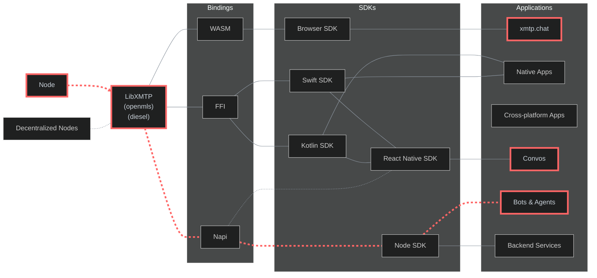

# XMTP QA Tools

This monorepo contains a comprehensive collection of tools for testing and monitoring the XMTP protocol and its implementations.

## Automated workflows

| Test suite   | Performance                                                                                                                                                                  | Resources                                                                                                                                                                                                                                                                          | Run frequency | Networks         |
| ------------ | ---------------------------------------------------------------------------------------------------------------------------------------------------------------------------- | ---------------------------------------------------------------------------------------------------------------------------------------------------------------------------------------------------------------------------------------------------------------------------------- | ------------- | ---------------- |
| Performance  | [](https://github.com/xmtp/xmtp-qa-tools/actions/workflows/Performance.yml) | [Workflow](https://github.com/xmtp/xmtp-qa-tools/actions/workflows/Performance.yml) / [Test code](https://github.com/xmtp/xmtp-qa-tools/tree/main/suites/metrics/Performance)                                                                                                      | Every 30 min  | `dev,production` |
| Delivery     | [](https://github.com/xmtp/xmtp-qa-tools/actions/workflows/Delivery.yml)       | [Workflow](https://github.com/xmtp/xmtp-qa-tools/actions/workflows/Delivery.yml) / [Test code](https://github.com/xmtp/xmtp-qa-tools/tree/main/suites/metrics/Delivery)                                                                                                            | Every 30 min  | `dev,production` |
| Groups       | [](https://github.com/xmtp/xmtp-qa-tools/actions/workflows/Large.yml)             | [Workflow](https://github.com/xmtp/xmtp-qa-tools/actions/workflows/Large.yml) / [Test code](https://github.com/xmtp/xmtp-qa-tools/tree/main/suites/metrics/Large)                                                                                                                  | Every 2 hours | `production`     |
| Agents       | [](https://github.com/xmtp/xmtp-qa-tools/actions/workflows/Agents.yml)           | [Workflow](https://github.com/xmtp/xmtp-qa-tools/actions/workflows/Agents.yml) / [Test code](https://github.com/xmtp/xmtp-qa-tools/tree/main/suites/automated/agents)                                                                                                              | Every 30 min  | `production`     |
| GM           | [](https://github.com/xmtp/xmtp-qa-tools/actions/workflows/Gm.yml)                   | [Workflow](https://github.com/xmtp/xmtp-qa-tools/actions/workflows/gm.yml) / [Test code](https://github.com/xmtp/xmtp-qa-tools/tree/main/suites/automated/gm)                                                                                                                      | Every 30 min  | `production`     |
| Group Stress |                                                                                                                                                                              | [Workflow](https://railway.com/project/cc97c743-1be5-4ca3-a41d-0109e41ca1fd/service/d92446b3-7ee4-43c9-a2ec-ceac87082970/schedule?environmentId=2d2be2e3-6f54-452c-a33c-522bcdef7792) / [Test code](https://github.com/xmtp/xmtp-qa-tools/tree/main/suites/automated/group-stress) | Every 2 hours | `production`     |

## Architecture

This flowchart illustrates the XMTP protocol's layered architecture and testing scope:



> The highlighted path (red dashed line) in the architecture diagram shows our main testing focus.

`LibXMTP` is a shared library built in Rust and compiled to WASM, Napi, and FFI bindings. It encapsulates the core cryptography functions of the XMTP messaging protocol. Due to the complexity of the protocol, we are using `openmls` as the underlying cryptographic library, it's important to test how this bindings perform in their own language environments.

We can test all XMTP bindings using three main applications. We use [xmtp.chat](https://xmtp.chat/) to test the Browser SDK's Wasm binding in actual web environments. We use [Convos](https://github.com/ephemeraHQ/converse-app) to test the React Native SDK, which uses both Swift and Kotlin FFI bindings for mobile devices. We use [agents](https://github.com/ephemeraHQ/xmtp-agent-examples) to test the Node SDK's Napi binding for server functions. This testing method checks the entire protocol across all binding types, making sure different clients work together, messages are saved, and users have the same experience across the XMTP system.

## Testing details

> Baseline is `us-east` region and `production` network.

- Multi-region testing nodes (`us-east`, `us-west` , `asia`, `europe` )
- 30-minute automated test execution intervals
- Comprehensive data aggregation in datadog
- All measurements are in `milliseconds`
- Testing directly on top of SDKs for real-world scenarios
- `dev` and `production` network covered
- Automated testing for web app `xmtp.chat`
- Manual testing for react native apps
- Simulated agent testing for real-world simulations

### TLDR: Metrics

- **Core SDK Performance**: Direct message creation (<500), group operations (<200-500)
- **Network Performance**: Server call (<100), TLS handshake (<100), total processing (<300)
- **Group Scaling**: Supports up to 300 members efficiently (create: 9s, operations: <350)
- **Regional Performance**: US/Europe optimal, Asia/South America higher latency (+46-160%)
- **Message Reliability**: 100% delivery rate (target: 99.9%), perfect ordering
- **Environments**: Production consistently outperfor Dev network by 5-9%

## Operation performance

### Core SDK Operations Performance

| Operation                | Description                            | Avg | Target | Performance  |
| ------------------------ | -------------------------------------- | --- | ------ | ------------ |
| clientCreate             | Creating a client                      | 588 | <350   | ⚠️ Concern   |
| inboxState               | Checking inbox state                   | 41  | <350   | ✅ On Target |
| newDm                    | Creating a direct message conversation | 258 | <350   | ✅ On Target |
| newDmWithIdentifiers     | Creating a dm by address               | 294 | <350   | ✅ On Target |
| sendGM                   | Sending a group message                | 126 | <200   | ✅ On Target |
| receiveGM                | Receiving a group message              | 87  | <200   | ✅ On Target |
| createGroup              | Creating a group                       | 315 | <350   | ✅ On Target |
| createGroupByIdentifiers | Creating a group by address            | 313 | <350   | ✅ On Target |
| syncGroup                | Syncing group state                    | 76  | <200   | ✅ On Target |
| updateGroupName          | Updating group metadata                | 129 | <200   | ✅ On Target |
| removeMembers            | Removing participants from a group     | 127 | <250   | ✅ On Target |
| sendGroupMessage         | Sending a group message                | 85  | <200   | ✅ On Target |
| receiveGroupMessage      | Processing group message strea         | 124 | <200   | ✅ On Target |

### Group operations performance

#### Sender-Side average performance

| Size | Send message | Update name | Remove members | Create | Performance  |
| ---- | ------------ | ----------- | -------------- | ------ | ------------ |
| 50   | 86           | 135         | 139            | 1329   | ✅ On Target |
| 100  | 88           | 145         | 157            | 1522   | ✅ On Target |
| 150  | 95           | 203         | 190            | 2306   | ✅ On Target |
| 200  | 93           | 193         | 205            | 3344   | ✅ On Target |
| 250  | 108          | 219         | 237            | 4276   | ⚠️ Concern   |
| 300  | 97           | 244         | 247            | 5463   | ⚠️ Concern   |
| 350  | 101          | 264         | 308            | 6641   | ⚠️ Concern   |
| 400  | 111          | 280         | 320            | 7641   | ⚠️ Concern   |

_Note: This measurments are taken only from the sender side and after the group is created._

#### Receiver-Side stream performance

| Group Size | New conversation | Metadata | Messages | Add Members | Performance  |
| ---------- | ---------------- | -------- | -------- | ----------- | ------------ |
| 50         | 687              | 141      | 131      | 401         | ✅ On Target |
| 100        | 746              | 155      | 117      | 420         | ✅ On Target |
| 150        | 833              | 163      | 147      | 435         | ✅ On Target |
| 200        | 953              | 179      | 173      | 499         | ✅ On Target |
| 250        | 1007             | 187      | 161      | 526         | ⚠️ Concern   |
| 300        | 1040             | 195      | 167      | 543         | ⚠️ Concern   |
| 350        | 1042             | 198      | 178      | 581         | ⚠️ Concern   |
| 400        | 1192             | 214      | 173      | 609         | ⚠️ Concern   |

_Note: This measurments are taken only from the receiver side and after the group is created._

#### Receiver-Side sync performance

| Size | syncAll |      | sync |      | Performance  |
| ---- | ------- | ---- | ---- | ---- | ------------ |
| 50   | 366     | ...  | 291  | ...  | ✅ On Target |
| 100  | 503     | 521  | 424  | 372  | ✅ On Target |
| 150  | 665     | 727  | 522  | 622  | ✅ On Target |
| 200  | 854     | 1066 | 653  | 936  | ✅ On Target |
| 250  | 966     | 1582 | 768  | 1148 | ⚠️ Concern   |
| 300  | 1225    | 1619 | 861  | 1362 | ⚠️ Concern   |
| 350  | 1322    | 1846 | 1218 | 2017 | ⚠️ Concern   |
| 400  | 1292    | 2082 | 1325 | 1792 | ⚠️ Concern   |

_Note: `syncAll` is measured only as the first cold start of the client (fresh inbox). Cumulative sync is measured as the first time all the groups are sync for the first time._

## Networks performance

### Network performance

| Performance Metric | Average | Target | Performance  |
| ------------------ | ------- | ------ | ------------ |
| DNS Lookup         | 13      | <50    | ✅ On Target |
| TCP Connection     | 48      | <70    | ✅ On Target |
| TLS Handshake      | 124     | <150   | ✅ On Target |
| Processing         | 35      | <100   | ✅ On Target |
| Server Call        | 159     | <250   | ✅ On Target |

### Regional Network Performance

| Region        | Server Call | TLS | ~ us-east | Performance  |
| ------------- | ----------- | --- | --------- | ------------ |
| us-east       | 140         | 123 | Baseline  | ✅ On Target |
| us-west       | 151         | 118 | <20% ~    | ✅ On Target |
| europe        | 230         | 180 | <40% ~    | ✅ On Target |
| asia          | 450         | 350 | >100% ~   | ⚠️ Concern   |
| south-america | 734         | 573 | >200% ~   | ⚠️ Concern   |

_Note: Baseline is `us-east` region and `production` network._

_Note: `Production` network consistently shows better network performance across all regions, with improvements ranging from 5.5% to 9.1%._

## Message reliability

### Message delivery testing

| Test Area            | Average         | Target         | Performance  |
| -------------------- | --------------- | -------------- | ------------ |
| Stream Delivery Rate | 100% successful | 99.9% minimum  | ✅ On Target |
| Poll Delivery Rate   | 100% successful | 99.9% minimum  | ✅ On Target |
| Recovery Rate        | 100% successful | 99.9% minimum  | ✅ On Target |
| Stream Order         | 100% in order   | 99.9% in order | ✅ On Target |
| Poll Order           | 100% in order   | 99.9% in order | ✅ On Target |
| Recovery Order       | 100% in order   | 99.9% in order | ✅ On Target |

_Note: Testing regularly in groups of `40` active members listening to one user sending 100 messages_

### Success criteria summary

| Metric                  | Current Performance         | Target                 | Performance  |
| ----------------------- | --------------------------- | ---------------------- | ------------ |
| Core SDK Operations     | All within targets          | Meet defined targets   | ✅ On Target |
| Small Group Operations  | ≤300                        | ≤300 for <50 members   | ✅ On Target |
| Medium Group Operations | ≤1000                       | ≤1000 for <400 members | ⚠️ Concern   |
| Network Performance     | All metrics within target   | Meet defined targets   | ✅ On Target |
| Message Delivery        | 100%                        | 99.9% minimum          | ✅ On Target |
| Stream Message Loss     | 100%                        | 99.9% minimum          | ✅ On Target |
| Poll Message Loss       | 100%                        | 99.9% minimum          | ✅ On Target |
| Message Order           | 100%                        | 100% in order          | ✅ On Target |
| South-america & Asia    | more than 40%               | <20% difference        | ⚠️ Concern   |
| US & Europe             | less than 20% variance      | <20% difference        | ✅ On Target |
| Dev vs Production       | Production 4.5-16.1% better | Production ≥ Dev       | ✅ On Target |

## Tools & utilities

- **Workflows:** Automated workflows - [see section](https://github.com/xmtp/xmtp-qa-tools/tree/main/.github/workflows)
- **Schedule:** Schedule workflows - [see section](https://github.com/xmtp/xmtp-qa-tools/actions?query=event:schedule)
- **Vitest:** Interactive vitest UI - [see section](https://xmtp-qa-toolsus-east-production.up.railway.app/__vitest__/#/)
- **Railway:** Railway project with all our services - [see section](https://railway.com/project/cc97c743-1be5-4ca3-a41d-0109e41ca1fd)
- **Bots:** Bots for testing with multiple agents - [see section](https://github.com/xmtp/xmtp-qa-tools/tree/main/bots/)
  - [`key-check.eth`](https://xmtp.chat/dm/0x235017975ed5F55e23a71979697Cd67DcAE614Fa): Verify key packages
  - [`stress-bot.eth`](https://xmtp.chat/dm/0x73BB05B6f1719ae0320701fC25d0bE64EBA59EB3): Stress test group operations
  - [`hi.xmtp.eth`](https://xmtp.chat/dm/0x937C0d4a6294cdfa575de17382c7076b579DC176): A bot that replies "hi" to all messages
- **Test suites:** Test suites directory - [see section](https://github.com/xmtp/xmtp-qa-tools/tree/main/suites/)

## Development

### Prerequisites

- Node.js (>20.18.0)
- Yarn 4.6.0

### Installation

```bash
# Installation For a faster download with just the latest code
git clone --depth=1 https://github.com/xmtp/xmtp-qa-tools
cd xmtp-qa-tools
yarn install
```

### Running tests

To get started set up the environment variables in [./env.example](./env.example) and run the tests with:

```bash
### simple dms test
yarn test dms
### full functional test
yarn test functional
### performance test example
yarn test performance
```

### Resources

- **Local:** Work in local network - [see section](/dev/)
- **Workers:** Worker for testing - [see section](/workers/)
- **Helpers:** Coding helpers - [see section](/helpers/)
- **Scripts:** Monorepo scripts - [see section](/scripts/)
- **Introduction:** Walkthrough of the monorepo - [see video](https://www.loom.com/share/f447b9a602e44093bce5412243e53664)
