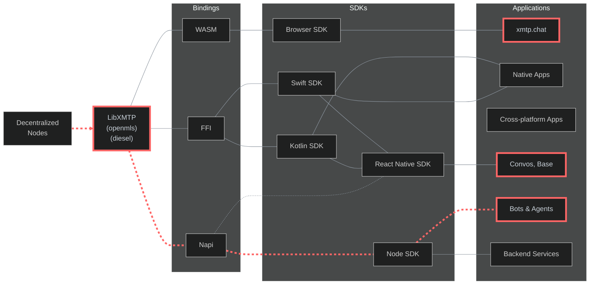

# XMTP qa tools

This monorepo contains a comprehensive collection of tools for testing and monitoring the XMTP protocol and its implementations.

## Automated workflows

| Test suite  | Status                                                                                                                                                                       | Resources                                                                                                                                                                        | Run frequency | Networks           |
| ----------- | ---------------------------------------------------------------------------------------------------------------------------------------------------------------------------- | -------------------------------------------------------------------------------------------------------------------------------------------------------------------------------- | ------------- | ------------------ |
| Functional  | [](https://github.com/xmtp/xmtp-qa-tools/actions/workflows/Functional.yml)    | [Workflow](https://github.com/xmtp/xmtp-qa-tools/actions/workflows/Functional.yml) / [Test code](https://github.com/xmtp/xmtp-qa-tools/tree/main/suites/functional)              | Every 3 hours | `dev` `production` |
| Performance | [](https://github.com/xmtp/xmtp-qa-tools/actions/workflows/Performance.yml) | [Workflow](https://github.com/xmtp/xmtp-qa-tools/actions/workflows/Performance.yml) / [Test code](https://github.com/xmtp/xmtp-qa-tools/tree/main/suites/performance.test.ts)    | Every 30 min  | `dev` `production` |
| Delivery    | [](https://github.com/xmtp/xmtp-qa-tools/actions/workflows/Delivery.yml)       | [Workflow](https://github.com/xmtp/xmtp-qa-tools/actions/workflows/Delivery.yml) / [Test code](https://github.com/xmtp/xmtp-qa-tools/tree/main/suites/delivery.test.ts)          | Every 30 min  | `dev` `production` |
| Groups      | [](https://github.com/xmtp/xmtp-qa-tools/actions/workflows/Large.yml)             | [Workflow](https://github.com/xmtp/xmtp-qa-tools/actions/workflows/Large.yml) / [Test code](https://github.com/xmtp/xmtp-qa-tools/tree/main/suites/large.test.ts)                | Every 2 hours | `dev` `production` |
| Agents      | [](https://github.com/xmtp/xmtp-qa-tools/actions/workflows/Agents.yml)           | [Workflow](https://github.com/xmtp/xmtp-qa-tools/actions/workflows/Agents.yml) / [Test code](https://github.com/xmtp/xmtp-qa-tools/tree/main/suites/agents)                      | Every 5 min   | `dev` `production` |
| Browser     | [](https://github.com/xmtp/xmtp-qa-tools/actions/workflows/Browser.yml)             | [Workflow](https://github.com/xmtp/xmtp-qa-tools/actions/workflows/Browser.yml) / [Test code](https://github.com/xmtp/xmtp-qa-tools/tree/main/suites/functional/browser.test.ts) | Every 30 min  | `dev` `production` |

## Architecture

This flowchart illustrates the XMTP protocol's layered architecture and testing scope:



> The highlighted path (red dashed line) in the architecture diagram shows our main testing focus.

`LibXMTP` is a shared library built in Rust and compiled to WASM, Napi, and FFI bindings. It encapsulates the core cryptography functions of the XMTP messaging protocol. Due to the complexity of the protocol, we are using `openmls` as the underlying cryptographic library, it's important to test how this bindings perform in their own language environments.

We can test all XMTP bindings using three main applications. We use [xmtp.chat](https://xmtp.chat/) to test the Browser SDK's Wasm binding in actual web environments. We use [Convos](https://github.com/ephemeraHQ/converse-app) to test the React Native SDK, which uses both Swift and Kotlin FFI bindings for mobile devices. We use [agents](https://github.com/ephemeraHQ/xmtp-agent-examples) to test the Node SDK's Napi binding for server functions. This testing method checks the entire protocol across all binding types, making sure different clients work together, messages are saved, and users have the same experience across the XMTP system.

#### Test coverage summary

- Protocol: DMs, groups, streams, sync, consent, client, codecs, installations, agents
- Performance: Benchmarking, reliability, mid-scale testing
- Compatibility: Backward compatibility across last +5 `node-sdk` versions.
- Production: Agent monitoring, security, concurrency, spam detection, rate limiting
- Automation: CI workflows with Datadog metrics, Slack alerting, browser log analysis
- Delivery: Delivery and order rate, response times.
- Network: Chaos network, latency, black hole, etc.
- Infrastructure: Multi-region testing across US, Europe, Asia, South America.

## Documentation

- Monitoring: E2E tests, metrics tracking, and alerting - see [section](./docs/monitoring.md)
- Measurements: Performance metrics and targets - see [section](./docs/measurements.md)
- Agents: Agent QA & monitoring - see [section](./suites/agents/README.md)
- Network: Network chaos testing - see [section](./suites/networkchaos/README.md)
- Forks: Probabilistic fork testing - see [section](./suites/forks/README.md)

## Tools & utilities

- Status: XMTP network status - [see section](https://status.xmtp.org/)
- Dashboard: Performance and monitoring datadog dashboard - [see section](https://p.datadoghq.com/sb/a5c739de-7e2c-11ec-bc0b-da7ad0900002-efaf10f4988297b8a8581128f2867a3d)
- Logging: Datadog error logging - [see section](https://app.datadoghq.com/logs?saved-view-id=3577190)
- Schedule: Scheduled workflows - [see section](https://github.com/xmtp/xmtp-qa-tools/actions?query=event:schedule)
- Railway: Multi-region services - [see section](https://railway.com/project/cc97c743-1be5-4ca3-a41d-0109e41ca1fd)
- Bots: Bots for testing with multiple agents - [see section](https://github.com/xmtp/xmtp-qa-tools/tree/main/bots/)
  - [`key-check.eth`](https://github.com/xmtp/xmtp-qa-tools/tree/main/bots/key-check): Verify key packages
  - [`hi.xmtp.eth`](https://github.com/xmtp/gm-bot): A bot that replies "gm" to all messages

## Development

#### Prerequisites

- Node.js (>20.18.0)
- Yarn 4.6.0

#### Installation

```bash
# Installation For a faster download with just the latest code
git clone --depth=1 https://github.com/xmtp/xmtp-qa-tools
cd xmtp-qa-tools
yarn install
```

#### Environment variables

```bash
XMTP_ENV="dev" #  environment (dev, production, local, multinode)
LOGGING_LEVEL="error" # Rust library logs
LOG_LEVEL="debug" # JS logs level
```

### Running tests

To get started set up the environment in [variables](./.env.example) and run the tests with:

```bash
# Simple dms test
yarn test dms
# Full functional test
yarn test functional
# Performance test example
yarn test performance
```

#### Debug mode

```bash
yarn test functional --no-fail --debug
```

> This will save logs to `logs/` directory and will not print to the terminal.

### Resources

- CLI: Command line interface for testing - see [section](./docs/cli-usage.md)
- Test suites: Test suites directory - [see section](https://github.com/xmtp/xmtp-qa-tools/tree/main/suites/)
- Inboxes: Inboxes for testing - [see section](/inboxes/)
- Networks: Work in [local](/dev/) or [multinode](/dev/multinode) network
- Workers: Worker for testing with CLI - [see section](/workers/)
- Helpers: Coding helpers - [see section](/helpers/)
- Scripts: Monorepo scripts & cli's - [see section](/cli/)
- Introduction: Walkthrough of the monorepo - [see video](https://www.loom.com/share/f447b9a602e44093bce5412243e53664)

##### Rate limits

- Read operations: 20,000 requests per 5-minute window
- Write operations: 3,000 messages published per 5-minute window

##### Endpoints

- `local`: `http://localhost:5556`
- `dev`: `https://grpc.dev.xmtp.network:443`
- `production`: `https://grpc.production.xmtp.network:443`
