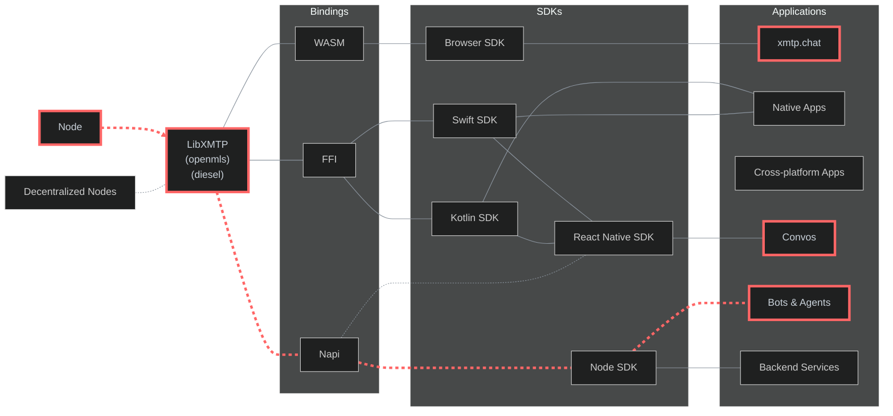

# XMTP QA Testing

## Automated workflows

| Test suite        | Status                                                                                                                                                                                        | Run frequency | Code                                                                                                     |
| ----------------- | --------------------------------------------------------------------------------------------------------------------------------------------------------------------------------------------- | ------------- | -------------------------------------------------------------------------------------------------------- |
| 🚀 Performance    | [](https://github.com/xmtp/xmtp-qa-testing/actions/workflows/TS_Performance.yml)             | Every 15 min  | [Test code](https://github.com/xmtp/xmtp-qa-testing/tree/main/suites/TS_Performance.test.ts)             |
| 📬 Delivery       | [](https://github.com/xmtp/xmtp-qa-testing/actions/workflows/TS_Delivery.yml)                   | Every 30 min  | [Test code](https://github.com/xmtp/xmtp-qa-testing/tree/main/suites/TS_Delivery.test.ts)                |
| 👋 Gm             | [](https://github.com/xmtp/xmtp-qa-testing/actions/workflows/TS_Gm.yml)                               | Every 30 min  | [Test code](https://github.com/xmtp/xmtp-qa-testing/tree/main/suites/TS_Gm.test.ts)                      |
| 🌎 Geolocation    | [](https://github.com/xmtp/xmtp-qa-testing/actions/workflows/TS_Geolocation.yml)             | Every 30 min  | [Workflow](https://github.com/xmtp/xmtp-qa-testing/blob/main/.github/workflows/TS_Geolocation.yml)       |
| 🔍 agent-examples | [](https://github.com/xmtp/xmtp-qa-testing/actions/workflows/check-agent-examples.yml) | Every 30 min  | [Workflow](https://github.com/xmtp/xmtp-qa-testing/blob/main/.github/workflows/check-agent-examples.yml) |

## Testing scope

This monorepo contains a comprehensive collection of tools for testing and monitoring the XMTP protocol and its implementations.

### Architecture

This flowchart illustrates the XMTP protocol's layered architecture and testing scope:



> The highlighted path (red dashed line) in the architecture diagram shows our main testing focus.

`LibXMTP` is a shared library built in Rust and compiled to WASM, Napi, and FFI bindings. It encapsulates the core cryptography functions of the XMTP messaging protocol. Due to the complexity of the protocol, we are using `openmls` as the underlying cryptographic library, it's important to test how this bindings perform in their own language environments.

We can test all XMTP bindings using three main applications. We use [xmtp.chat](https://xmtp.chat/) to test the Browser SDK's Wasm binding in actual web environments. We use [Convos](https://github.com/ephemeraHQ/converse-app) to test the React Native SDK, which uses both Swift and Kotlin FFI bindings for mobile devices. We use [agents](https://github.com/ephemeraHQ/xmtp-agent-examples) to test the Node SDK's Napi binding for server functions. This testing method checks the entire protocol across all binding types, making sure different clients work together, messages are saved, and users have the same experience across the XMTP system.

### Testing details

- Multi-region testing nodes (`us-east`, `us-west` , `asia`, `europe` )
- 30-minute automated test execution intervals
- Comprehensive data aggregation in datadog
- Testing directly on top of SDKs for real-world scenarios
- `dev` and `production` network covered
- Automated testing for web app `xmtp.chat`
- Manual testing for react native app
- Human & agents testing for real-world simulations

### TLDR: Metrics

- **Core SDK Performance**: Direct message creation (<500ms), group operations (<200-500ms)
- **Network Performance**: Server call (<100ms), TLS handshake (<100ms), total processing (<300ms)
- **Group Scaling**: Supports up to 300 members efficiently (create: 9s, operations: <350ms)
- **Regional Performance**: US/Europe optimal, Asia/South America higher latency (+46-160%)
- **Message Reliability**: 100% delivery rate (target: 99.9%), perfect ordering
- **Environments**: Production consistently outperforms Dev network by 5-9%

## Operation performance

### Core SDK Operations Performance

| Operation                | Description                            | Avg (ms) | Target | Status                 |
| ------------------------ | -------------------------------------- | -------- | ------ | ---------------------- |
| clientCreate             | Creating a client                      | 588.18   | <350ms | ⚠️ Performance Concern |
| inboxState               | Checking inbox state                   | 41.37    | <350ms | ✅ On Target           |
| newDm                    | Creating a direct message conversation | 258.05   | <350ms | ✅ On Target           |
| newDmWithIdentifiers     | Creating a dm by address               | 294.23   | <350ms | ✅ On Target           |
| sendGM                   | Sending a group message                | 126.19   | <200ms | ✅ On Target           |
| receiveGM                | Receiving a group message              | 86.82    | <200ms | ✅ On Target           |
| createGroup              | Creating a group                       | 315.25   | <350ms | ✅ On Target           |
| createGroupByIdentifiers | Creating a group by address            | 312.83   | <350ms | ✅ On Target           |
| syncGroup                | Syncing group state                    | 75.96    | <200ms | ✅ On Target           |
| updateGroupName          | Updating group metadata                | 128.86   | <200ms | ✅ On Target           |
| removeMembers            | Removing participants from a group     | 127.06   | <250ms | ✅ On Target           |
| sendGroupMessage         | Sending a group message                | 85.27    | <200ms | ✅ On Target           |
| receiveGroupMessage      | Processing group message streams       | 124.00   | <200ms | ✅ On Target           |

### Group Operations Performance by Size

| Size | Create(ms) | Send(ms) | Sync(ms) | Update(ms) | Remove(ms) | Status                 |
| ---- | ---------- | -------- | -------- | ---------- | ---------- | ---------------------- |
| 50   | 1152.73    | 86.01    | 78.33    | 135.36     | 138.57     | ✅ On Target           |
| 100  | 1582.43    | 88.41    | 83.48    | 144.67     | 156.86     | ✅ On Target           |
| 150  | 2650.67    | 94.55    | 120.24   | 202.64     | 189.81     | ✅ On Target           |
| 200  | 4117.80    | 93.42    | 128.73   | 193.36     | 204.78     | ✅ On Target           |
| 250  | 5740.75    | 107.76   | 154.79   | 219.17     | 236.53     | ⚠️ Performance Concern |
| 300  | 7656.24    | 97.09    | 145.75   | 244.24     | 247.22     | ⚠️ Performance Concern |
| 350  | 8272.22    | 99.20    | 155.32   | 244.24     | 270.62     | ⚠️ Performance Concern |
| 400  | 9215.61    | 101.34   | 167.90   | 263.91     | 308.01     | ⚠️ Performance Concern |

### Group stream performance

| Group Size | Message (ms) | Metadata (ms) | Conversations (ms) | Sync Time (ms) | Status                 |
| ---------- | ------------ | ------------- | ------------------ | -------------- | ---------------------- |
| 50         | 74           | 117           | 68                 | 9.32           | ✅ On Target           |
| 100        | 18           | 115           | 71                 | 8.94           | ✅ On Target           |
| 150        | 62           | 203           | 178                | 8.79           | ✅ On Target           |
| 200        | 1661         | 1568          | 1958               | 8.94           | ⚠️ Performance Concern |
| 250        | 3834         | 3761          | 3799               | 15.23          | ⚠️ Performance Concern |
| 300        | 6622         | 6973          | 7361               | 15.24          | ❌ Performance Issue   |
| 350        | 9536         | 9278          | 10313              | 18.07          | ❌ Performance Issue   |
| 400        | 11922        | 11674         | 12487              | 20             | ❌ Performance Issue   |

_Note: Based on data from measured operations in the `us-east` region and `production` network._

## Networks performance

### Network performance

| Performance Metric | Current Performance | Target | Status       |
| ------------------ | ------------------- | ------ | ------------ |
| DNS Lookup         | 13.65ms avg         | <50ms  | ✅ On Target |
| TCP Connection     | 48.10ms avg         | <70ms  | ✅ On Target |
| TLS Handshake      | 124.11ms avg        | <150ms | ✅ On Target |
| Processing         | 35.17ms avg         | <100ms | ✅ On Target |
| Server Call        | 159.22ms avg        | <250ms | ✅ On Target |

_Note: Performance metrics based on `us-east` testing on `production` network._

### Regional Network Performance

| Region        | Server Call (ms) | TLS (ms) | ~ us-east | Status                 |
| ------------- | ---------------- | -------- | --------- | ---------------------- |
| us-east       | 158.70           | 123.75   | Baseline  | ✅ On Target           |
| us-west       | 151.91           | 118.59   | -4.3%     | ✅ On Target           |
| europe        | 159.84           | 125.04   | +0.7%     | ✅ On Target           |
| asia          | 152.32           | 119.43   | -3.9%     | ✅ On Target           |
| south-america | 754.6            | 573.1    | +160.3%   | ⚠️ Performance Concern |

_Note: Baseline is `us-east` region and `production` network._

### Dev vs Production Network Performance Comparison

| Region        | Dev (ms) | Production (ms) | Difference | Status                 |
| ------------- | -------- | --------------- | ---------- | ---------------------- |
| us-east       | 158.70   | 162.91          | +2.7%      | ✅ Dev Better          |
| us-west       | 151.91   | 188.87          | +24.3%     | ⚠️ Performance Concern |
| europe        | 159.84   | 141.36          | -11.5%     | ✅ Production Better   |
| asia          | 152.32   | 172.09          | +13.0%     | ⚠️ Performance Concern |
| south-america | 754.6    | 573.1           | -24.1%     | ✅ Production Better   |

_Note: `Production` network consistently shows better network performance across all regions, with improvements ranging from 5.5% to 9.1%._

## Message reliability

### Message delivery testing

| Test Area            | Current Performance | Target         | Status       |
| -------------------- | ------------------- | -------------- | ------------ |
| Stream Delivery Rate | 100% successful     | 99.9% minimum  | ✅ On Target |
| Poll Delivery Rate   | 100% successful     | 99.9% minimum  | ✅ On Target |
| Recovery Rate        | 100% successful     | 99.9% minimum  | ✅ On Target |
| Stream Order         | 100% in order       | 99.9% in order | ✅ On Target |
| Poll Order           | 100% in order       | 99.9% in order | ✅ On Target |
| Recovery Order       | 100% in order       | 99.9% in order | ✅ On Target |

_Note: Testing regularly in groups of `40` active members listening to one user sending 100 messages_

### Success criteria summary

| Metric               | Current Performance         | Target                 | Status                 |
| -------------------- | --------------------------- | ---------------------- | ---------------------- |
| Core SDK Operations  | All within targets          | Meet defined targets   | ✅ On Target           |
| Group Operations     | ≤300 members                | ≤300 members on target | ✅ On Target           |
| Network Performance  | All metrics within target   | Meet defined targets   | ✅ On Target           |
| Message Delivery     | 100%                        | 99.9% minimum          | ✅ On Target           |
| Stream Message Loss  | 100%                        | 99.9% minimum          | ✅ On Target           |
| Poll Message Loss    | 100%                        | 99.9% minimum          | ✅ On Target           |
| Message Order        | 100%                        | 100% in order          | ✅ On Target           |
| South-america & Asia | more than 40%               | <20% difference        | ⚠️ Performance Concern |
| US & Europe          | less than 20% variance      | <20% difference        | ✅ On Target           |
| Dev vs Production    | Production 4.5-16.1% better | Production ≥ Dev       | ✅ On Target           |

## 🧪 XMTP Test Suites

Different end-to-end test suites for validating the XMTP protocol functionality, performance, and reliability.

| Suite              | Purpose                                                    | Link to test file                                         |
| ------------------ | ---------------------------------------------------------- | --------------------------------------------------------- |
| **TS_AgentHealth** | Tests the health of the agent ecosystem                    | [TS_AgentHealth](./TS_AgentHealth/TS_AgentHealth.test.ts) |
| **TS_Delivery**    | Verifies message delivery reliability                      | [TS_Delivery](./TS_Delivery/TS_Delivery.test.ts)          |
| **TS_Fork**        | Investigates group conversation forking through membership | [TS_Fork](./TS_Fork/TS_Fork.test.ts)                      |
| **TS_Gm**          | Tests basic messaging and cross-version compatibility      | [TS_Gm](./TS_Gm/TS_Gm.test.ts)                            |
| **TS_Performance** | Measures independent operational performance               | [TS_Performance](./TS_Performance/TS_Performance.test.ts) |
| **TS_Large**       | Tests performance of group operations                      | [TS_Large](./TS_Large/TS_Large.test.ts)                   |

All test suites provide metrics to monitoring dashboards and can be executed both manually and through automated CI/CD workflows.

## Tools & utilities

- **Repository:** [xmtp-qa-testing](https://github.com/xmtp/xmtp-qa-testing): This monorepo contains multiple tools for testing and monitoring
- **Workflows:** See our CI/CD pipeline configuration - [see section](https://github.com/xmtp/xmtp-qa-testing/tree/main/.github/workflows)
- **Vitest:** We use Vitest for running tests with an interactive UI - [see section](https://xmtp-qa-testingus-east-production.up.railway.app/__vitest__/#/)
- **Railway:** Visit our Railway project with all our services - [see section](https://railway.com/project/cc97c743-1be5-4ca3-a41d-0109e41ca1fd)
- **Bots:** Bots for testing with multiple agents - [see section](https://github.com/xmtp/xmtp-qa-testing/tree/main/bots/)

## Development

### Prerequisites

- Node.js (>20.18.0)
- Yarn 4.6.0

### Installation

```bash
# Installation For a faster download with just the latest code
git clone --depth=1 https://github.com/xmtp/xmtp-qa-testing
cd xmtp-qa-testing
yarn install
```

### Resources

- **Local:** Work in local network with [dev section](/dev/)
- **Workers:** Predefined workers like `bob`, `alice`, `randomguy` with [workers](/workers/)
- **Helpers:** Utility functions in the [helpers section](/helpers/)
- **Scripts:** Automation scripts in the [scripts section](/scripts/)
- **Loom recording:** [Loom recording](https://www.loom.com/share/f447b9a602e44093bce5412243e53664)
