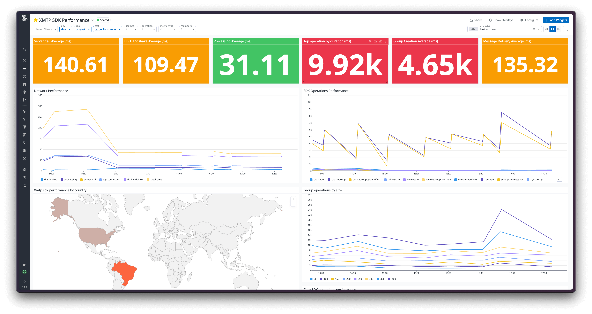

# XMTP QA Testing Suite

This monorepo contains a comprehensive collection of tools for testing and monitoring the XMTP protocol and its implementations.

### Test Status

| Test Suite     | Dev Network Status                                                                                                                                                                     | Production Network Status                                                                                                                                                                                   | Run frequency |
| -------------- | -------------------------------------------------------------------------------------------------------------------------------------------------------------------------------------- | ----------------------------------------------------------------------------------------------------------------------------------------------------------------------------------------------------------- | ------------- |
| 🚀 Performance | [](https://github.com/xmtp/xmtp-qa-testing/actions/workflows/TS_Performance_dev.yml) | [](https://github.com/xmtp/xmtp-qa-testing/actions/workflows/TS_Performance_production.yml) | Every 30 min  |
| 📬 Delivery    | [](https://github.com/xmtp/xmtp-qa-testing/actions/workflows/TS_Delivery_dev.yml)       | [](https://github.com/xmtp/xmtp-qa-testing/actions/workflows/TS_Delivery_production.yml)       | Every 30 min  |
| 👋 Gm          | [](https://github.com/xmtp/xmtp-qa-testing/actions/workflows/TS_Gm_dev.yml)             | [](https://github.com/xmtp/xmtp-qa-testing/actions/workflows/TS_Gm_production.yml)             | Every 30 min  |
| 🌎 Geolocation | [](https://github.com/xmtp/xmtp-qa-testing/actions/workflows/TS_Geolocation_dev.yml) | [](https://github.com/xmtp/xmtp-qa-testing/actions/workflows/TS_Geolocation_production.yml) | Every 30 min  |

### Performance dashboard



- **Datadog:** Explore more in the [dashboards section](./dashboards/)

### Core SDK Operations Performance

| Operation           | Description                            | Avg (ms) | Target | Status       |
| ------------------- | -------------------------------------- | -------- | ------ | ------------ |
| createDM            | Creating a direct message conversation | 254-306  | <500ms | ✅ On Target |
| sendGM              | Sending a group message                | 123-132  | <200ms | ✅ On Target |
| receiveGM           | Receiving a group message              | 90-94    | <200ms | ✅ On Target |
| receiveGroupMessage | Processing group message streams       | 119-127  | <200ms | ✅ On Target |
| updateGroupName     | Updating group metadata                | 105-108  | <200ms | ✅ On Target |
| syncGroup           | Syncing group state                    | 78-89    | <200ms | ✅ On Target |
| addMembers          | Adding participants to a group         | 238-280  | <500ms | ✅ On Target |
| removeMembers       | Removing participants from a group     | 147-168  | <300ms | ✅ On Target |
| inboxState          | Checking inbox state                   | 36       | <100ms | ✅ On Target |

_Note: Based on data from 79 measured operations in the `us-east` testing environment._

### Group Operations Performance by Size

| Size | Create(ms) | Send(ms) | Sync(ms) | Update(ms) | Remove(ms) | Target(Create) | Status                 |
| ---- | ---------- | -------- | -------- | ---------- | ---------- | -------------- | ---------------------- |
| 50   | 990        | 71       | 61       | 81         | 140        | <2,000ms       | ✅ On Target           |
| 100  | 1,599      | 67       | 66       | 91         | 182        | <2,000ms       | ✅ On Target           |
| 150  | 2,956      | 72       | 85       | 104        | 183        | <4,000ms       | ✅ On Target           |
| 200  | 4,598      | 73       | 103      | 139        | 211        | <5,000ms       | ✅ On Target           |
| 250  | 5,983      | 76       | 120      | 164        | 234        | <7,000ms       | ✅ On Target           |
| 300  | 8,707      | 81       | 321      | 255        | 309        | <9,000ms       | ✅ On Target           |
| 350  | 9,826      | 79       | 132      | 228        | 368        | <11,000ms      | ⚠️ Performance Concern |
| 400  | 11,451     | 84       | 170      | 427        | 501        | <15,000ms      | ⚠️ Performance Concern |
| 450  | -          | -        | -        | -          | -          | -              | ❌ Severe impact       |

_Note: Performance increases significantly beyond `350` members, which represents a hard limit on the protocol._

### Network performance

| Performance Metric   | Current Performance | Target            | Status       |
| -------------------- | ------------------- | ----------------- | ------------ |
| Server Call Response | 78.4ms avg          | <100ms P95        | ✅ On Target |
| TLS Handshake        | 83.6ms avg          | <100ms P95        | ✅ On Target |
| Message Processing   | 212.5ms avg         | <300ms end-to-end | ✅ On Target |

_Note: Performance metrics based on `us-east` testing on dev and production network._

### Regional Network Performance

| Region        | Server_Call(ms) | TLS_Handshake(ms) | ~ us-east | Status                 |
| ------------- | --------------- | ----------------- | --------- | ---------------------- |
| us-east       | 276.6           | 87.2              | Baseline  | ✅ On Target           |
| us-west       | 229.3           | 111.1             | -15.6%    | ✅ On Target           |
| europe        | 178.5           | 111.4             | -33.2%    | ✅ On Target           |
| us            | 155.7           | 121.0             | -40.8%    | ✅ On Target           |
| asia          | 411.0           | 103.7             | +46.5%    | ⚠️ Performance Concern |
| south-america | 754.6           | 573.1             | +160.3%   | ⚠️ Performance Concern |

_Note: Regional performance testing shows significant latency increases in south-america (+160.3%) and asia (+46.5%) regions compared to the `us-east` baseline._

### Message delivery testing

| Test Area              | Current Performance | Target          | Status       |
| ---------------------- | ------------------- | --------------- | ------------ |
| Stream Delivery Rate   | 100% successful     | 99.9% minimum   | ✅ On Target |
| Poll Delivery Rate     | 100% successful     | 99.9% minimum   | ✅ On Target |
| Stream Order           | 100% in order       | 100% in order   | ✅ On Target |
| Poll Order             | 100% in order       | 100% in order   | ✅ On Target |
| Offline Recovery Rate  | 100% successful     | 100% successful | ✅ On Target |
| Offline Recovery Order | 100% in order       | 100% in order   | ✅ On Target |

_Note: Testing regularly in groups of `40` active members listening to one user sending 100 messages_

- **Datadog:** Explore more in the [dashboards section](./dashboards/)

### Stream vs. Poll reliability

| Retrieval Method | Reliability   | Latency           | Use Case               | Status       |
| ---------------- | ------------- | ----------------- | ---------------------- | ------------ |
| Stream-based     | 100% delivery | Real-time         | Active conversations   | ✅ On Target |
| Poll-based       | 100% delivery | Delayed (30s max) | Backup/recovery        | ✅ On Target |
| Hybrid approach  | 100% delivery | Optimized         | Recommended for Agents | ✅ On Target |

_Note: A hybrid approach using `streams` with `poll`-based verification provides the most reliable message delivery guarantee._

- **Datadog:** Explore more in the [dashboards section](./dashboards/)

### Cross-SDK Testing

| SDK Combination          | Test Focus                    | Status      |
| ------------------------ | ----------------------------- | ----------- |
| Node SDK ↔ Node SDK     | Agent-to-Agent communication  | ✅ Verified |
| Web ↔ Node SDK          | Client-to-Agent communication | ✅ Verified |
| React Native ↔ Node SDK | Client-to-Agent communication | ✅ Verified |

_Note: Cross-SDK was tested using the `operations` describe above and is not covering all edge cases._

### Success criteria summary

| Metric                  | Current Performance       | Target                 | Status                 |
| ----------------------- | ------------------------- | ---------------------- | ---------------------- |
| Core SDK Operations     | All within targets        | Meet defined targets   | ✅ On Target           |
| Group Operations        | ≤300 members              | ≤300 members on target | ✅ On Target           |
| Network Performance     | All metrics within target | Meet defined targets   | ✅ On Target           |
| Message Delivery        | 100%                      | 99.9% minimum          | ✅ On Target           |
| Stream Message Loss     | 100%                      | 99.9% minimum          | ✅ On Target           |
| Stream Message Loss     | 100%                      | 99.9% minimum          | ✅ On Target           |
| Cross-SDK Compatibility | 100%                      | 100% operation success | ✅ On Target           |
| South-america & Asia    | more than 40%             | <20% difference        | ⚠️ Performance Concern |
| US & Europe             | less than 20% variance    | <20% difference        | ✅ On Target           |

#### Disclaimers

- **Ideal Network Conditions**: Real-world performance may vary significantly when the network is under stress or high load.
- **Pre-Release Status**: This assessment reflects the current development version targeting the `4.0.0` stable release. Optimizations and improvements are ongoing.

## Tools & Utilities

- **Bots:** Bots for testing, see our [bots section](./bots/)
- **Workflows:** See our CI/CD pipeline configuration in the [workflows section](/.github/workflows)
- **Bugs:** We document bugs in the [bugs folder](./bugs/) for easy reproduction and tracking.
- **Vitest:** We use Vitest for running tests with an interactive [UI](https://xmtp-qa-testing.up.railway.app/__vitest__/#/)
- **Railway:** Visit our [Railway project](https://railway.com/project/cc97c743-1be5-4ca3-a41d-0109e41ca1fd)
- **QA Board:** Follow progress on the [QA Board](https://github.com/orgs/xmtp/projects/30)
- **Repo Issues:** Report bugs and feature requests in the [repo issues](https://github.com/xmtp/xmtp-qa-testing/issues)
- **Datadog:** Explore more in the [dashboards section](./dashboards/)

## Development

### Prerequisites

- Node.js (>20.18.0)
- Yarn 4.6.0

### Installation

```bash
git clone https://github.com/xmtp/xmtp-qa-testing
cd xmtp-qa-testing
yarn install
```

### Resources

- **Local:** Work in local network with [dev section](/dev/)
- **Workers:** Predefined personas like `bob`, `alice`, `randomguy` with [workers](/workers/)
- **Helpers:** Utility functions in the [helpers section](/helpers/)
- **Scripts:** Automation scripts in the [scripts section](/scripts/)
