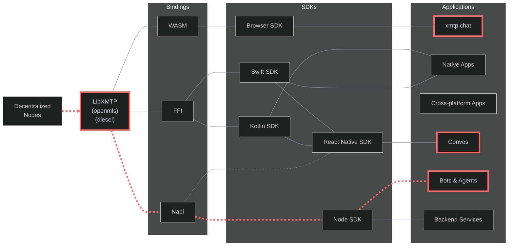

# XMTP QA Tools Documentation

Hey everyone, this is our comprehensive testing setup for XMTP. We've built a pretty robust suite of automated tools that validate network performance, message delivery, and protocol correctness across all our environments.

## Quick navigation

### Core systems
- [Monitoring system](./docs/monitoring.md) - Metrics tracking, Slack integration, and alerting
- [Dashboards](./docs/dashboards.md) - Datadog dashboards and visualization guides
- [Test suites](./docs/test-suites.md) - Comprehensive overview of all automated test suites
- [Workflows](./docs/workflows.md) - GitHub Actions CI/CD automation and deployment

### Performance and reliability
- [SLOs and SLIs](./docs/slos-slis.md) - Service Level Objectives and performance targets
- [Scaling limitations](./docs/scaling-limitations.md) - Current constraints and optimization opportunities
- [Streams](./docs/streams.md) - Message streaming reliability, order validation, and response time testing

### Specialized testing
- [Agents QA](./docs/agents-qa.md) - Agent and bot testing framework
- [Forks](./docs/forks.md) - Protocol fork testing and version compatibility
- [Incident response](./docs/incident-response.md) - Incident management and escalation procedures


## Automated workflows

| Test suite  | Performance                                                                                                                                                                  | Resources                                                                                                                                                                             | Run frequency | Networks           |
| ----------- | ---------------------------------------------------------------------------------------------------------------------------------------------------------------------------- | ------------------------------------------------------------------------------------------------------------------------------------------------------------------------------------- | ------------- | ------------------ |
| Functional  | [](https://github.com/xmtp/xmtp-qa-tools/actions/workflows/Functional.yml)    | [Workflow](https://github.com/xmtp/xmtp-qa-tools/actions/workflows/Functional.yml) / [Test code](https://github.com/xmtp/xmtp-qa-tools/tree/main/suites/functional)                   | Every 3 hours | `dev` `production` |
| Performance | [](https://github.com/xmtp/xmtp-qa-tools/actions/workflows/Performance.yml) | [Workflow](https://github.com/xmtp/xmtp-qa-tools/actions/workflows/Performance.yml) / [Test code](https://github.com/xmtp/xmtp-qa-tools/tree/main/suites/metrics/performance.test.ts) | Every 30 min  | `dev` `production` |
| Delivery    | [](https://github.com/xmtp/xmtp-qa-tools/actions/workflows/Delivery.yml)       | [Workflow](https://github.com/xmtp/xmtp-qa-tools/actions/workflows/Delivery.yml) / [Test code](https://github.com/xmtp/xmtp-qa-tools/tree/main/suites/metrics/delivery.test.ts)       | Every 30 min  | `dev` `production` |
| Groups      | [](https://github.com/xmtp/xmtp-qa-tools/actions/workflows/Large.yml)             | [Workflow](https://github.com/xmtp/xmtp-qa-tools/actions/workflows/Large.yml) / [Test code](https://github.com/xmtp/xmtp-qa-tools/tree/main/suites/metrics/large.test.ts)             | Every 2 hours | `dev` `production` |
| Agents      | [](https://github.com/xmtp/xmtp-qa-tools/actions/workflows/Agents.yml)           | [Workflow](https://github.com/xmtp/xmtp-qa-tools/actions/workflows/Agents.yml) / [Test code](https://github.com/xmtp/xmtp-qa-tools/tree/main/suites/agents)                           | Every 15 min  | `dev` `production` |
| Browser     | [](https://github.com/xmtp/xmtp-qa-tools/actions/workflows/Browser.yml)             | [Workflow](https://github.com/xmtp/xmtp-qa-tools/actions/workflows/Browser.yml) / [Test code](https://github.com/xmtp/xmtp-qa-tools/tree/main/suites/functional/browser.test.ts)      | Every 30 min  | `dev` `production` |

## Architecture

This flowchart illustrates the XMTP protocol's layered architecture and testing scope:



> The highlighted path (red dashed line) in the architecture diagram shows our main testing focus.

`LibXMTP` is a shared library built in Rust and compiled to WASM, Napi, and FFI bindings. It encapsulates the core cryptography functions of the XMTP messaging protocol. Due to the complexity of the protocol, we are using `openmls` as the underlying cryptographic library, it's important to test how this bindings perform in their own language environments.

We can test all XMTP bindings using three main applications. We use [xmtp.chat](https://xmtp.chat/) to test the Browser SDK's Wasm binding in actual web environments. We use [Convos](https://github.com/ephemeraHQ/converse-app) to test the React Native SDK, which uses both Swift and Kotlin FFI bindings for mobile devices. We use [agents](https://github.com/ephemeraHQ/xmtp-agent-examples) to test the Node SDK's Napi binding for server functions. This testing method checks the entire protocol across all binding types, making sure different clients work together, messages are saved, and users have the same experience across the XMTP system.

## Test coverage

- Protocol: DMs, groups, streams, sync, consent, codecs, installations
- Performance: Benchmarking, delivery reliability, large-scale testing (up to 400 members)
- Compatibility: Backward compatibility across last 3 SDK versions (0.0.47 → 2.2.0+)
- Cross-platform: Browser automation, mobile testing, multi-region performance
- Production: Live agent monitoring, security, spam detection, rate limiting
- Automation: CI workflows with Datadog metrics, Slack alerting, log analysis
- Verification: Stream delivery, conversation state, metadata propagation
- Tools: Playwright browser testing, CLI utilities, AI-powered Slack bot
- Infrastructure: Multi-region testing across US, Europe, Asia, South America

## Documentation

- Measurments: Benchmarks recorded periodically [see section](https://github.com/xmtp/xmtp-qa-tools/issues/1012)
- Monitoring: Monitoring system [see section](https://github.com/xmtp/xmtp-qa-tools/issues/1011)
- Datadog: Datadog dashboard [see section](https://github.com/xmtp/xmtp-qa-tools/issues/1016)
- SLOs: Expected metrics and targets [see section](https://github.com/xmtp/xmtp-qa-tools/issues/1013)
- Complete Documentation: [docs/](./docs/) - Testing infrastructure guides

## Tools & utilities

- Status: XMTP network status - [see section](https://status.xmtp.org/)
- Workflows: Automated workflows - [see section](https://github.com/xmtp/xmtp-qa-tools/tree/main/.github/workflows)
- Logging: Datadog error logs - [see section](https://app.datadoghq.com/logs?saved-view-id=3577190)
- Schedule: Schedule workflows - [see section](https://github.com/xmtp/xmtp-qa-tools/actions?query=event:schedule)
- Railway: Railway project with all our services - [see section](https://railway.com/project/cc97c743-1be5-4ca3-a41d-0109e41ca1fd)
- Bots: Bots for testing with multiple agents - [see section](https://github.com/xmtp/xmtp-qa-tools/tree/main/bots/)
  - [`key-check.eth`](https://xmtp.chat/dm/0x235017975ed5F55e23a71979697Cd67DcAE614Fa): Verify key packages
  - [`hi.xmtp.eth`](https://xmtp.chat/dm/0x937C0d4a6294cdfa575de17382c7076b579DC176): A bot that replies "hi" to all messages
- Test suites: Test suites directory - [see section](https://github.com/xmtp/xmtp-qa-tools/tree/main/suites/)

## Development

#### Prerequisites

- Node.js (>20.18.0)
- Yarn 4.6.0

#### Installation

```bash
# Installation For a faster download with just the latest code
git clone --depth=1 https://github.com/xmtp/xmtp-qa-tools
cd xmtp-qa-tools
yarn install
```

#### Environment variables

```bash
XMTP_ENV="dev" #  environment (dev, production, local, multinode)
LOGGING_LEVEL="error" # Rust library logs
LOG_LEVEL="debug" # JS logs level
```

### Running tests

To get started set up the environment in [variables](./.env.example) and run the tests with:

```bash
# Simple dms test
yarn test dms
# Full functional test
yarn test functional
# Performance test example
yarn test performance
```

#### Debug mode

```bash
yarn test functional --no-fail --debug
```

> This will save logs to `logs/` directory and will not print to the terminal.

## What we're testing

We run automated workflows every 30 minutes that cover the core areas that matter:

### Testing framework
We've got 8 automated test suites running continuously. These hit all the critical paths - Browser SDK, Node SDK, React Native, Swift, and Kotlin bindings. We can scale test up to 400-member groups and use Playwright for real browser testing. Plus we monitor all our deployed bots to make sure they're responding.

### Monitoring and observability  
Everything feeds into Datadog with custom dashboards. Slack gets automated alerts when things break. We track a 99.9% delivery rate target and have error budgets that tell us when we're burning through our reliability allowance too fast. We test across multiple regions so we catch geographic issues.

### Infrastructure and automation
GitHub Actions runs everything on a schedule that doesn't overwhelm our systems. Railway hosts our bots. We test against dev, production, and local environments. The benchmarking is automated so we catch performance regressions before they become problems.

## Key metrics and targets

These are the numbers we actually care about hitting:

### Core SLOs
| Metric | Target | Environment |
|--------|--------|-------------|
| Message delivery rate | 99.9% | Production |
| Message latency (P95) | <3 seconds | Production |
| Service availability | 99.95% | Production |
| Cross-platform compatibility | 99.5% | All environments |
| Large group performance | 95% delivery for 400 members | All environments |

### Test suite coverage
The automated workflows run on these schedules:
- Functional tests: Core protocol validation every 3 hours
- Performance tests: Benchmarking every 30 minutes  
- Delivery tests: Cross-environment reliability every 30 minutes
- Browser tests: Web environment validation every 30 minutes
- Agent tests: Bot health monitoring every 15 minutes
- Large group tests: Scale testing every 2 hours

## Support and contact

### For issues
- Immediate support: #xmtp-qa-alerts Slack channel
- Bug reports: GitHub issues in [xmtp-qa-tools repository](https://github.com/xmtp/xmtp-qa-tools)

### For questions
- Technical questions: Engineering team via Slack
- Process questions: QA team via Slack  
- Monitoring issues: DevOps team or Datadog support

### External resources
- Network status: [status.xmtp.org](https://status.xmtp.org/)
- Performance dashboard: [Datadog XMTP Dashboard](https://app.datadoghq.com/dashboard/your-dashboard-id)
- Railway services: [Railway Project](https://railway.com/project/cc97c743-1be5-4ca3-a41d-0109e41ca1fd)
- GitHub Actions: [Scheduled workflows](https://github.com/xmtp/xmtp-qa-tools/actions?query=event:schedule)

### Resources

- Inboxes: Inboxes for testing - [see section](/inboxes/)
- Local: Work in local network - [see section](/dev/)
- Workers: Worker for testing - [see section](/workers/)
- Helpers: Coding helpers - [see section](/helpers/)
- Scripts: Monorepo scripts - [see section](/scripts/)
- Introduction: Walkthrough of the monorepo - [see video](https://www.loom.com/share/f447b9a602e44093bce5412243e53664)

##### Rate limits

- Read operations: 20,000 requests per 5-minute window
- Write operations: 3,000 messages published per 5-minute window

##### Endpoints

- `local`: `http://localhost:5556`
- `dev`: `https://grpc.dev.xmtp.network:443`
- `production`: `https://grpc.production.xmtp.network:443`
