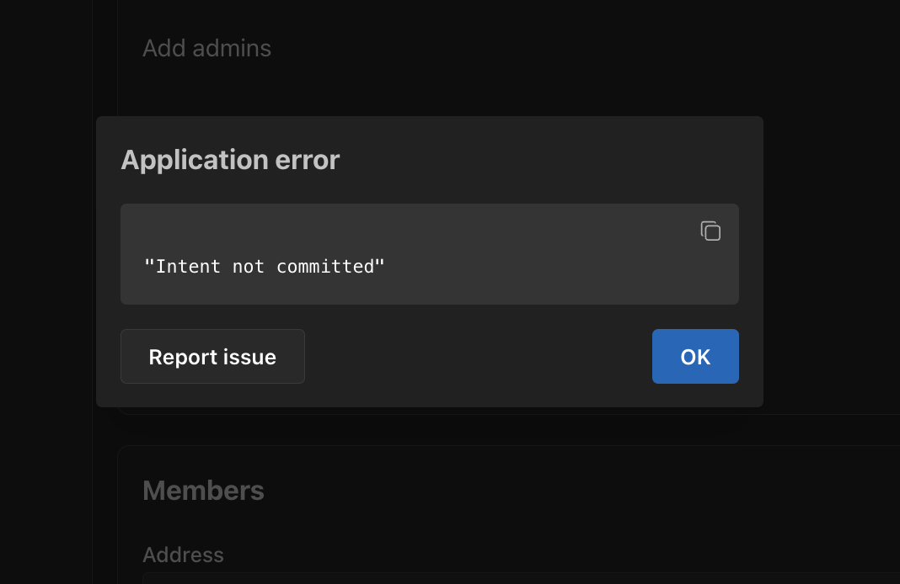
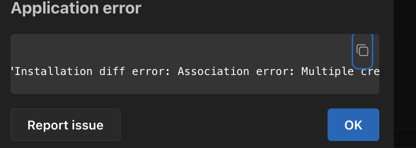
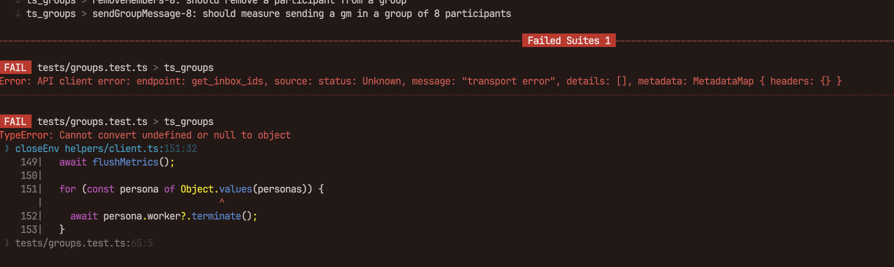

# 🐛 Bug Report

Installations with conflicts:

```bash
WALLET_KEY_BOB=0x5f46d3d8d907f9d8194883eadfd5ff09541f753a9b3a9bae61b44d8bbcebe5dc
ENCRYPTION_KEY_BOB=f16952b3228aebf237c97320205f16ad737b69b9b170d5783b70b3f27cee7582
# public key 0x1c541A1c11095aa7b36Cf138922Da1bF6a6bD54c

WALLET_KEY_ALICE=0x57ea7fe4438577d21a6e0b32200e1a1b1b1354c4243831dc48e6907a2f2c049e
ENCRYPTION_KEY_ALICE=f16952b3228aebf237c97320205f16ad737b69b9b170d5783b70b3f27cee7582
# public key 0x95484cb08200C26F69131CD5cb5a1b3acb0FAa30

WALLET_KEY_JOE=0xea072a5e64b90cd2f6280d7331fc6d8bbbdb6aa8eee8aacd4e7f1615ff4997dd
ENCRYPTION_KEY_JOE=f16952b3228aebf237c97320205f16ad737b69b9b170d5783b70b3f27cee7582
# public key 0x1dd038E110b53152af9491cf490C36B1cC720dAa
```

## Reproduce

### Fails in xmtp to create group in xmtp chat with only 2



### Fails to create with 3 wallets



### Fails in convos it hangs


### Random failures in node 20



## Description

```bash
git clone https://github.com/xmtp/xmtp-qa-testing/
cd xmtp-qa-testing
yarn
yarn test bug_installation
```

## Test code

- Test [code](./test.test.ts)

### Logs

- [libxmtp](./libxmtp.log) log
- [test logs](./test.log) log

### Environment

- [./data](/.data/) folder
- [.env](/.env) file
