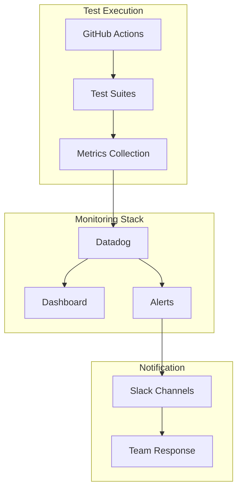

# Monitoring System

The XMTP QA Tools monorepo employs a sophisticated monitoring system that tracks protocol performance, reliability metrics, and service health across multiple environments and regions.

## Overview

Our monitoring infrastructure provides real-time visibility into:
- **Message delivery rates** across development and production networks
- **Performance benchmarks** for SDK operations and protocol functions
- **Service health** for bots, agents, and infrastructure components
- **Error tracking** with automated alerting via Slack integration

## Architecture



## Key Metrics Tracked

### Delivery Metrics
- **Delivery Rate**: Percentage of messages successfully delivered across environments
- **Order Rate**: Percentage of messages delivered in correct sequence
- **Latency**: End-to-end message delivery time
- **Cross-Platform Compatibility**: Success rates between different SDK bindings

### Performance Metrics
- **SDK Operation Timing**: Benchmarks for client creation, conversation setup, message sending
- **Large Group Performance**: Scalability metrics for groups up to 400 members
- **Browser Automation**: Playwright test execution times and success rates
- **Agent Response Times**: Bot and automation agent performance metrics

### Infrastructure Health
- **Service Uptime**: Monitoring for deployed bots and services on Railway
- **Error Rates**: Tracking failures across test suites and workflows
- **Resource Usage**: Memory and CPU utilization for long-running tests

## Datadog Integration

### Dashboard Configuration

The main dashboard (`dashboard.json`) provides visualizations for:

```json
{
  "title": "XMTP SDK Performance",
  "description": "Metrics for XMTP SDK operations (DNS, TLS, Server Processing)",
  "widgets": [
    {
      "title": "Delivery Rate (%)",
      "type": "query_value",
      "query": "avg:xmtp.sdk.delivery{$env,$region,$test,$sdk,$members}",
      "conditional_formats": [
        { "comparator": ">=", "value": 99, "palette": "white_on_green" },
        { "comparator": ">=", "value": 95, "palette": "white_on_yellow" },
        { "comparator": "<", "value": 95, "palette": "white_on_red" }
      ]
    }
  ]
}
```

### Custom Metrics

All metrics are prefixed with `xmtp.sdk.` and include tags for:
- `env`: Environment (dev, production)
- `region`: Geographic region for multi-region testing
- `test`: Test suite name
- `sdk`: SDK version being tested
- `members`: Group size for scaling tests

## Slack Integration

### Alert Channels

Automated notifications are sent to dedicated Slack channels:
- **#xmtp-qa-alerts**: Critical failures and SLO violations
- **#xmtp-qa-metrics**: Daily performance summaries
- **#xmtp-qa-deploys**: Deployment status and Railway updates

### Alert Configuration

Alerts trigger when:
- Delivery rate drops below 95% for more than 5 minutes
- Any test suite fails consecutively for 3 runs
- Critical infrastructure services become unavailable
- Performance degrades beyond established thresholds

## Logging

### Datadog Logs

All test execution logs are centralized in Datadog with:
- **Structured logging** with consistent format across all test suites
- **Error aggregation** and pattern detection
- **Log correlation** with metrics and traces
- **Search and filtering** capabilities for debugging

View logs: [Datadog Error Logs](https://app.datadoghq.com/logs?saved-view-id=3577190)

### Local Development

For debugging during development:

```bash
# Enable debug logging
export LOG_LEVEL="debug"
export LOGGING_LEVEL="debug"

# Run tests with detailed logs saved to file
yarn test functional --no-fail --debug
```

Logs are saved to the `logs/` directory when using `--debug` mode.

## SLOs and Alerting

### Service Level Objectives

| Metric | Target | Measurement Period | Alert Threshold |
|--------|--------|-------------------|------------------|
| Message Delivery Rate | 99.9% | 24 hours | < 95% for 5 minutes |
| Cross-SDK Compatibility | 99.5% | 7 days | < 98% for 15 minutes |
| Agent Response Time | < 2 seconds | 1 hour | > 5 seconds for 3 minutes |
| Test Suite Success Rate | 98% | 24 hours | < 95% for 2 consecutive runs |

### Escalation

1. **Level 1**: Slack notification to #xmtp-qa-alerts
2. **Level 2**: Page on-call engineer for critical failures lasting > 15 minutes
3. **Level 3**: Escalate to engineering leadership for systematic issues

## Network Status

Real-time network status is available at: [status.xmtp.org](https://status.xmtp.org/)

This provides public visibility into:
- XMTP network health across all environments
- Historical uptime and performance data
- Planned maintenance windows
- Incident reports and post-mortems

## Configuration

### Environment Variables

```bash
# Datadog configuration
DD_API_KEY="your_datadog_api_key"
DD_APP_KEY="your_datadog_app_key"

# Slack webhook for alerts
SLACK_WEBHOOK_URL="your_slack_webhook_url"

# Monitoring settings
MONITORING_ENABLED="true"
METRICS_INTERVAL="30000"  # 30 seconds
```

### Custom Metrics Submission

Test suites can submit custom metrics using the helper utilities:

```typescript
import { submitMetric } from '../helpers/datadog';

// Submit a custom performance metric
await submitMetric('xmtp.test.custom_metric', value, {
  env: process.env.XMTP_ENV,
  test_name: 'my_test',
  region: 'us-east-1'
});
```

## Troubleshooting

### Common Issues

1. **Missing Metrics**: Verify Datadog API credentials and network connectivity
2. **Slack Alerts Not Firing**: Check webhook URL and channel permissions
3. **High False Positive Rate**: Adjust alert thresholds based on baseline performance

### Debug Commands

```bash
# Test Datadog connectivity
yarn test helpers/datadog --verbose

# Validate dashboard configuration
node scripts/validate-dashboard.js

# Send test Slack notification
node scripts/test-slack-alert.js
```

### Support

For monitoring-related issues:
- Review logs in Datadog dashboard
- Check #xmtp-qa-alerts for recent notifications
- Contact the QA team via Slack or GitHub issues