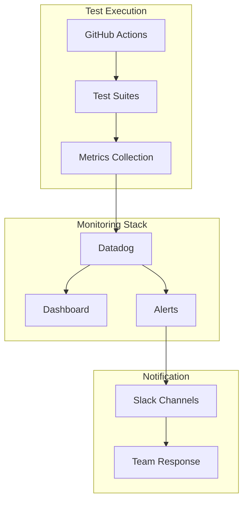

# Monitoring system

Hey, this is how we keep an eye on everything that's happening with XMTP. We've built a pretty solid monitoring setup that tells us when things are working well and alerts us immediately when they're not.

## Architecture



## Key metrics

- Delivery rate
- Order rate
- Latency
- Cross-platform compatibility
- SDK operation timing
- Large group performance
- Agent response times
- Service uptime
- Error rates
- Resource usage

## Datadog integration

### Dashboard setup

The main dashboard (`dashboard.json`) shows us:

```json
{
  "title": "XMTP SDK Performance",
  "widgets": [
    {
      "title": "Delivery Rate (%)",
      "query": "avg:xmtp.sdk.delivery{$env,$region,$test,$sdk,$members}"
    }
  ]
}
```

See [Dashboards](./dashboards.md) for full details.

### Custom metrics

All metrics are prefixed with `xmtp.sdk.` and include tags for:

- `env`: Environment (dev, production)
- `region`: Geographic region for multi-region testing
- `test`: Test suite name
- `sdk`: SDK version being tested
- `members`: Group size for scaling tests

## Configuration

### Environment variables

```bash
DD_API_KEY="your_datadog_api_key"
SLACK_WEBHOOK_URL="your_slack_webhook_url"
```

### Custom metrics submission

Test suites can submit custom metrics using the helper utilities:

```typescript
import { submitMetric } from "../helpers/datadog";

await submitMetric("xmtp.sdk.delivery", 99.8, { env: "production" });
```
