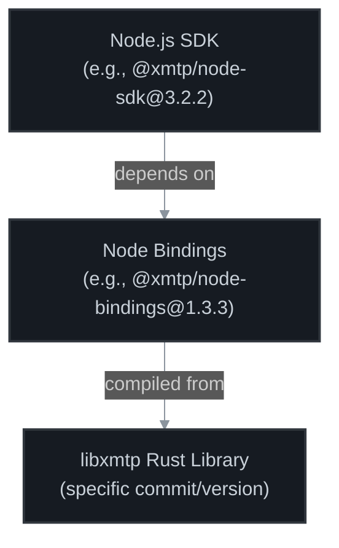

# SDK Version Management

## Overview

How XMTP SDK versions relate to the underlying `libxmtp` Rust library and how to test with custom versions.

## Architecture: [NodeSDK](https://www.npmjs.com/package/@xmtp/node-sdk?activeTab=versions) → [Bindings](https://www.npmjs.com/package/@xmtp/node-bindings?activeTab=versions) → [libxmtp](https://github.com/xmtp/libxmtp)



- **SDKs**: Thin TypeScript wrappers providing developer-friendly API
- **Bindings**: Compiled Rust code and native bindings
- **libxmtp**: Core cryptographic and networking logic

## Version mapping system

Versions are mapped in `workers/versions.ts`:

```typescript
export const VersionList = [
  {
    Client: Client322,
    Conversation: Conversation322,
    Dm: Dm322,
    Group: Group322,
    nodeSDK: "3.2.2", // SDK version
    nodeBindings: "1.3.3", // Bindings version
    auto: true, // Include in automated testing
  },
];
```

### Package Aliases

Multiple versions installed via npm aliases:

```json
{
  "dependencies": {
    "@xmtp/node-sdk-3.2.2": "npm:@xmtp/node-sdk@3.2.2",
    "@xmtp/node-bindings-1.3.3": "npm:@xmtp/node-bindings@1.3.3"
  }
}
```

### Dynamic Linking

`yarn versions` creates symlinks:

```
node_modules/@xmtp/
├── node-sdk-3.2.2/
│   └── node_modules/@xmtp/
│       └── node-bindings -> ../../node-bindings-1.3.3/
└── node-bindings-1.3.3/
```

### Process

1. Developer creates libxmtp branch
2. Node bindings CI compiles new libxmtp into `@xmtp/node-bindings`
3. New bindings package published to npm
4. QA tools updated with new bindings version
5. Tests run against new version

### Switch between versions

If your libxmtp version is already compiled:

1. Find the bindings version containing your libxmtp commit
2. Update mapping in `workers/versions.ts`
3. Point any SDK to that bindings version

```typescript
{
  nodeSDK: "3.2.2",
  nodeBindings: "1.3.1",  // Use existing bindings
  auto: false,               // Manual testing only
}
```

## Version discovery

### Finding libxmtp Version

The libxmtp commit hash is in:

```bash
node_modules/@xmtp/node-bindings-X.X.X/dist/version.json
```

### Using Versions Command

```bash
yarn versions
```

Shows current SDK → bindings mappings.

## Testing Different Versions

### Automated Testing

```bash
yarn test functional --versions 3  # Test 3 auto-enabled versions
```

### Manual Testing

```bash
yarn test functional --nodeSDK 3.2.2
```

### Regression Testing

```bash
yarn regression  # Vibe check on latest version
```
