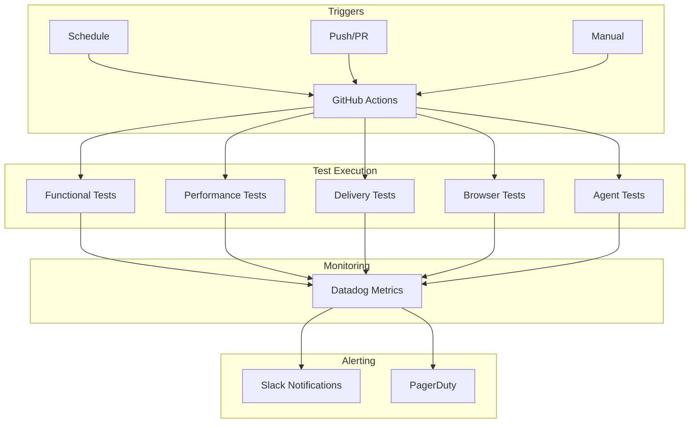

# Workflows

This is how we automate all our testing and make sure nothing breaks without us knowing about it immediately. We've got GitHub Actions running pretty much constantly, testing everything from basic functionality to large-scale performance under different conditions.

## How our automation works

Our workflow setup gives us:
- **Continuous Testing**: Automated test execution across multiple environments
- **Performance Monitoring**: Regular benchmarking and metric collection
- **Deployment Automation**: Streamlined deployment and rollback processes
- **Quality Assurance**: Code quality checks and compatibility validation

## Workflow Architecture



## Core Test Workflows

### 1. Functional Test Workflow

**File**: `.github/workflows/Functional.yml`
**What it does**: Makes sure the basic XMTP protocol stuff actually works

```yaml
name: Functional
on:
  schedule:
    - cron: '0 */3 * * *'  # Every 3 hours
  workflow_dispatch:
  push:
    branches: [main]

jobs:
  functional-tests:
    runs-on: ubuntu-latest
    strategy:
      matrix:
        env: [dev, production]
        node-version: [20.x]
    
    steps:
      - uses: actions/checkout@v4
      - name: Setup Node.js
        uses: actions/setup-node@v4
        with:
          node-version: ${{ matrix.node-version }}
          cache: 'yarn'
      
      - name: Install dependencies
        run: yarn install --frozen-lockfile
      
      - name: Run functional tests
        run: yarn test functional
        env:
          XMTP_ENV: ${{ matrix.env }}
          LOG_LEVEL: 'error'
      
      - name: Upload test results
        uses: actions/upload-artifact@v3
        if: always()
        with:
          name: functional-test-results-${{ matrix.env }}
          path: |
            logs/
            test-results.json
```

**Execution Frequency**: Every 3 hours + on pushes to main
**Environments**: `dev`, `production`
**Average Runtime**: 15-25 minutes
**Success Rate SLO**: 98%

### 2. Performance Test Workflow

**File**: `.github/workflows/Performance.yml`
**Purpose**: Benchmarks SDK operations and measures latency

```yaml
name: Performance
on:
  schedule:
    - cron: '*/30 * * * *'  # Every 30 minutes
  workflow_dispatch:

jobs:
  performance-tests:
    runs-on: ubuntu-latest
    steps:
      - uses: actions/checkout@v4
      - name: Setup Node.js
        uses: actions/setup-node@v4
        with:
          node-version: '20.x'
          cache: 'yarn'
      
      - name: Install dependencies
        run: yarn install --frozen-lockfile
      
      - name: Run performance tests
        run: yarn test performance
        env:
          XMTP_ENV: production
          DATADOG_API_KEY: ${{ secrets.DATADOG_API_KEY }}
      
      - name: Submit metrics to Datadog
        run: node scripts/submit-performance-metrics.js
        env:
          DD_API_KEY: ${{ secrets.DATADOG_API_KEY }}
```

**Key Metrics Collected**:
- Client creation time
- Message send latency
- Stream initialization time
- Memory usage patterns
- Cross-platform compatibility rates

### 3. Delivery Test Workflow

**File**: `.github/workflows/Delivery.yml`
**Purpose**: Validates message delivery reliability across environments

```yaml
name: Delivery
on:
  schedule:
    - cron: '*/30 * * * *'  # Every 30 minutes

jobs:
  delivery-tests:
    runs-on: ubuntu-latest
    strategy:
      matrix:
        source-env: [dev, production]
        target-env: [dev, production]
    steps:
      - name: Cross-environment delivery test
        run: yarn test delivery:cross-env
        env:
          SOURCE_ENV: ${{ matrix.source-env }}
          TARGET_ENV: ${{ matrix.target-env }}
```

**Test Matrix**:
- dev → dev
- dev → production  
- production → dev
- production → production

### 4. Large Groups Test Workflow

**File**: `.github/workflows/Large.yml`
**Purpose**: Tests group functionality at scale (up to 400 members)

```yaml
name: Large Groups
on:
  schedule:
    - cron: '0 */2 * * *'  # Every 2 hours

jobs:
  large-group-tests:
    runs-on: ubuntu-latest
    timeout-minutes: 180  # 3 hour timeout for large groups
    
    strategy:
      matrix:
        group-size: [50, 100, 200, 400]
        env: [dev, production]
    
    steps:
      - name: Run large group test
        run: yarn test metrics/large
        env:
          GROUP_SIZE: ${{ matrix.group-size }}
          XMTP_ENV: ${{ matrix.env }}
          TEST_TIMEOUT: 7200000  # 2 hour timeout
```

**Performance Targets**:
- 400 members: 95% delivery rate in <60 seconds
- 200 members: 98% delivery rate in <30 seconds
- 100 members: 99% delivery rate in <20 seconds
- 50 members: 99.5% delivery rate in <10 seconds

### 5. Agents Test Workflow

**File**: `.github/workflows/Agents.yml`
**Purpose**: Monitors deployed bot and agent health

```yaml
name: Agents
on:
  schedule:
    - cron: '*/15 * * * *'  # Every 15 minutes

jobs:
  agent-health-check:
    runs-on: ubuntu-latest
    strategy:
      matrix:
        agent:
          - name: "hi.xmtp.eth"
            address: "0x937C0d4a6294cdfa575de17382c7076b579DC176"
            expected-response: "hi"
          - name: "key-check.eth" 
            address: "0x235017975ed5F55e23a71979697Cd67DcAE614Fa"
            expected-response: "Key package status"
    
    steps:
      - name: Test agent responsiveness
        run: yarn test agents:health-check
        env:
          AGENT_NAME: ${{ matrix.agent.name }}
          AGENT_ADDRESS: ${{ matrix.agent.address }}
          EXPECTED_RESPONSE: ${{ matrix.agent.expected-response }}
```

**Monitored Agents**:
- **hi.xmtp.eth**: Simple greeting bot (SLO: <2s response)
- **key-check.eth**: Key package verification (SLO: <5s response)

### 6. Browser Test Workflow

**File**: `.github/workflows/Browser.yml`
**Purpose**: Validates XMTP functionality in browser environments using Playwright

```yaml
name: Browser
on:
  schedule:
    - cron: '*/30 * * * *'  # Every 30 minutes

jobs:
  browser-tests:
    runs-on: ubuntu-latest
    steps:
      - uses: actions/checkout@v4
      - name: Setup Node.js
        uses: actions/setup-node@v4
        with:
          node-version: '20.x'
      
      - name: Install dependencies
        run: yarn install --frozen-lockfile
      
      - name: Install Playwright browsers
        run: npx playwright install
      
      - name: Run browser tests
        run: yarn test browser
        env:
          XMTP_ENV: production
      
      - name: Upload Playwright report
        uses: actions/upload-artifact@v3
        if: always()
        with:
          name: playwright-report
          path: playwright-report/
```

**Browser Coverage**:
- Chrome (latest stable)
- Firefox (latest stable)
- WebKit/Safari (latest stable)

## Deployment Workflows

### 1. Deploy Workflow

**File**: `.github/workflows/Deploy.yml`
**Purpose**: Handles Railway deployments with automated PR management

```yaml
name: Deploy
on:
  push:
    paths: ['package.json']
    branches: [main]

jobs:
  deploy:
    runs-on: ubuntu-latest
    steps:
      - name: Check version bump
        id: version-check
        run: |
          VERSION=$(node -p "require('./package.json').version")
          echo "version=$VERSION" >> $GITHUB_OUTPUT
      
      - name: Create deployment PR
        uses: actions/github-script@v6
        with:
          script: |
            const version = '${{ steps.version-check.outputs.version }}';
            // Create PR for Railway deployment
            await github.rest.pulls.create({
              owner: context.repo.owner,
              repo: context.repo.repo,
              title: `Deploy v${version} to Railway`,
              head: 'main',
              base: 'deploy',
              body: `Automated deployment for version ${version}`
            });
```

**Railway Integration**:
- Automatic deployment on version bump
- Environment-specific configurations
- Health check validation post-deployment

### 2. Bot Deployment

**Railway Configuration**:
```toml
# railway.toml
[build]
builder = "NIXPACKS"

[deploy]
healthcheckPath = "/health"
healthcheckTimeout = 300

[[services]]
name = "gm-bot"
source = "bots/gm-bot"

[[services]]
name = "stress-bot"
source = "bots/stress"
```

## Validation Workflows

### 1. Code Quality Validation

**File**: `.github/workflows/validate-code-quality.yml`

```yaml
name: Code Quality
on:
  push:
    branches-ignore: [main]
  pull_request:

jobs:
  code-quality:
    runs-on: ubuntu-latest
    steps:
      - name: Lint code
        run: yarn lint
      
      - name: Type check
        run: yarn type-check
      
      - name: Run unit tests
        run: yarn test:unit
      
      - name: Check formatting
        run: yarn format:check
```

### 2. Package Compatibility

**File**: `.github/workflows/validate-package-compatibility.yml`

```yaml
name: Package Compatibility
on:
  push:
    branches: [main]

jobs:
  compatibility:
    runs-on: ${{ matrix.os }}
    strategy:
      matrix:
        os: [ubuntu-latest, macos-latest, windows-latest]
        node-version: [18.x, 20.x, 22.x]
        package-manager: [npm, yarn]
    
    steps:
      - name: Test package installation
        run: |
          ${{ matrix.package-manager }} install
          ${{ matrix.package-manager }} run test:basic
```

## Specialized Workflows

### 1. Network Chaos Testing

**File**: `.github/workflows/NetworkChaos.yml`
**Purpose**: Tests protocol resilience under adverse network conditions

```yaml
name: Network Chaos
on:
  workflow_dispatch:
    inputs:
      chaos-type:
        description: 'Type of chaos to inject'
        required: true
        default: 'partition'
        type: choice
        options:
        - partition
        - latency
        - packet-loss

jobs:
  chaos-test:
    runs-on: ubuntu-latest
    steps:
      - name: Setup chaos environment
        run: |
          docker run -d --name chaos-controller chaos-engineering/litmus
      
      - name: Inject network chaos
        run: |
          yarn test chaos:${{ github.event.inputs.chaos-type }}
```

### 2. Agent Repository Validation

**File**: `.github/workflows/validate-agents-repo.yml`
**Purpose**: Validates external agent examples repository

```yaml
name: Validate Agents Repo
on:
  schedule:
    - cron: '0 */6 * * *'  # Every 6 hours

jobs:
  validate-agents:
    runs-on: ubuntu-latest
    steps:
      - name: Clone agent examples
        run: |
          git clone https://github.com/ephemeraHQ/xmtp-agent-examples.git
          cd xmtp-agent-examples
      
      - name: Build and test agents
        run: |
          yarn install
          yarn build
          yarn test
```

## Workflow Scheduling

### Schedule Matrix

| Workflow | Frequency | Primary Trigger | Backup Trigger |
|----------|-----------|----------------|----------------|
| **Functional** | Every 3 hours | Schedule | Push to main |
| **Performance** | Every 30 minutes | Schedule | Manual |
| **Delivery** | Every 30 minutes | Schedule | Manual |
| **Large Groups** | Every 2 hours | Schedule | Manual |
| **Agents** | Every 15 minutes | Schedule | Manual |
| **Browser** | Every 30 minutes | Schedule | Manual |
| **Code Quality** | On PR/Push | Push | PR creation |
| **Deployment** | On version bump | Package.json change | Manual |

### Peak Usage Management

**Load Balancing Strategy**:
```yaml
# Stagger execution to avoid resource contention
schedules:
  functional: '0 */3 * * *'    # :00, :03, :06, :09, :12, :15, :18, :21
  performance: '*/30 * * * *'  # :00, :30
  delivery: '15,45 * * * *'    # :15, :45  
  browser: '10,40 * * * *'     # :10, :40
  agents: '*/15 * * * *'       # :00, :15, :30, :45
```

## Monitoring and Alerting

### Workflow Health Monitoring

**Datadog Integration**:
```typescript
// Automatic workflow metrics submission
const workflowMetrics = {
  'github.workflow.execution_time': executionTime,
  'github.workflow.success_rate': successRate,
  'github.workflow.failure_count': failureCount
};

await submitMetrics(workflowMetrics, {
  workflow_name: 'functional',
  environment: 'production',
  branch: 'main'
});
```

### Failure Alerting

**Slack Integration**:
```yaml
- name: Notify on failure
  if: failure()
  uses: 8398a7/action-slack@v3
  with:
    status: failure
    channel: '#xmtp-qa-alerts'
    text: |
      🚨 Workflow Failed: ${{ github.workflow }}
      Branch: ${{ github.ref }}
      Commit: ${{ github.sha }}
      Run: ${{ github.server_url }}/${{ github.repository }}/actions/runs/${{ github.run_id }}
```

### Success Rate Tracking

**SLO Monitoring**:
- **Functional Tests**: 98% success rate over 24 hours
- **Performance Tests**: 95% success rate over 24 hours  
- **Delivery Tests**: 99% success rate over 24 hours
- **Agent Health**: 99% success rate over 24 hours

## Workflow Optimization

### Performance Improvements

#### 1. Caching Strategy
```yaml
- name: Cache dependencies
  uses: actions/cache@v3
  with:
    path: |
      ~/.yarn/cache
      node_modules
    key: ${{ runner.os }}-yarn-${{ hashFiles('**/yarn.lock') }}
    restore-keys: |
      ${{ runner.os }}-yarn-
```

#### 2. Matrix Optimization
```yaml
# Fail-fast disabled for comprehensive testing
strategy:
  fail-fast: false
  matrix:
    env: [dev, production]
    # Only test critical combinations to reduce resource usage
    include:
      - env: dev
        timeout: 30
      - env: production
        timeout: 60
```

#### 3. Resource Management
```yaml
jobs:
  test:
    runs-on: ubuntu-latest
    # Limit concurrent jobs to prevent resource exhaustion
    concurrency:
      group: ${{ github.workflow }}-${{ github.ref }}
      cancel-in-progress: true
```

### Retry Mechanisms

**Flaky Test Handling**:
```yaml
- name: Run tests with retry
  uses: nick-invision/retry@v2
  with:
    timeout_minutes: 30
    max_attempts: 3
    retry_on: error
    command: yarn test functional
```

## Best Practices

### 1. Workflow Design Principles

- **Idempotent Operations**: All workflows can be safely re-run
- **Fast Feedback**: Critical tests run frequently with short feedback loops
- **Resource Efficiency**: Staggered execution prevents resource contention
- **Comprehensive Coverage**: Matrix testing across environments and configurations

### 2. Error Handling

```yaml
- name: Cleanup on failure
  if: always()
  run: |
    # Clean up test artifacts
    docker system prune -f
    rm -rf temp-*
    
    # Submit failure metrics
    if [ "${{ job.status }}" = "failure" ]; then
      node scripts/submit-failure-metric.js
    fi
```

### 3. Security Considerations

**Secret Management**:
```yaml
env:
  DATADOG_API_KEY: ${{ secrets.DATADOG_API_KEY }}
  SLACK_WEBHOOK: ${{ secrets.SLACK_WEBHOOK }}
  # Never log sensitive environment variables
  XMTP_PRIVATE_KEY: ${{ secrets.XMTP_PRIVATE_KEY }}
```

### 4. Documentation and Maintenance

**Self-Documenting Workflows**:
```yaml
name: Functional Tests
# Purpose: Validates core XMTP protocol functionality
# Frequency: Every 3 hours + on main branch pushes
# SLO: 98% success rate over 24 hours
# Owner: QA Team
# Escalation: #xmtp-qa-alerts
```

## Future Improvements

### Planned Enhancements

#### Q1 2024: Advanced Analytics
- [ ] Implement workflow performance analytics
- [ ] Add predictive failure detection
- [ ] Create workflow dependency mapping

#### Q2 2024: Scaling Improvements  
- [ ] Implement distributed test execution
- [ ] Add dynamic resource allocation
- [ ] Optimize for multi-region testing

#### Q3 2024: Intelligence Integration
- [ ] Add AI-powered test selection
- [ ] Implement smart retry mechanisms
- [ ] Create automated workflow optimization

### Monitoring Evolution

**Enhanced Metrics Collection**:
- Workflow execution cost analysis
- Resource utilization optimization
- Cross-workflow dependency tracking
- Performance regression detection

**Advanced Alerting**:
- Predictive failure alerts
- Trend-based anomaly detection
- Workflow efficiency recommendations