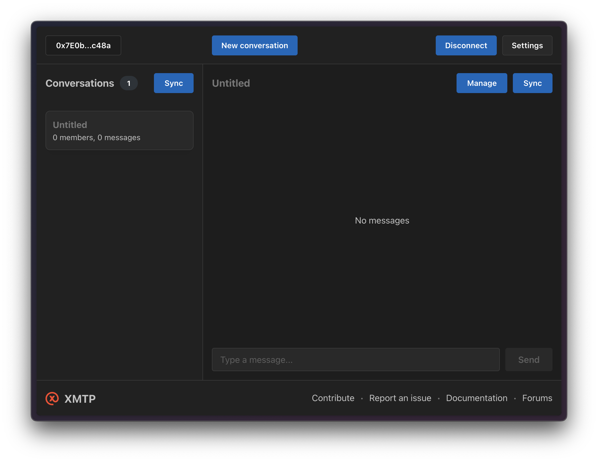

# Start a 4-node XMTP cluster on your local machine

`Dev` and `production` networks are hosted by XMTP, while `local` network is hosted by yourself. Use local network for development purposes only.

- 1. Install docker
- 2. Launch 4 XMTP nodes and database

```bash
./multinode/up
```

- 3. Change the .env file to use the local multinode network

```bash
XMTP_ENV=local
```

- 4. Debug with [xmtp.chat](https://xmtp.chat/)


