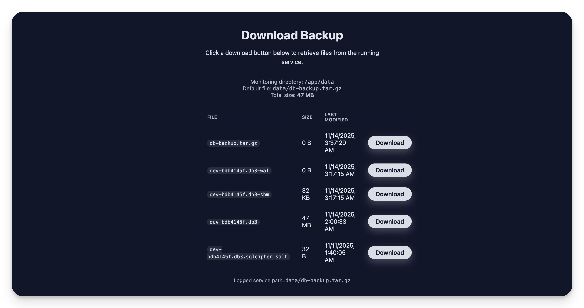

# Local database backup

This guide walks you through cloning the repository, deploying the download
server to Railway, and accessing the backups listing on port `8080`.

> [!NOTE]  
> THis guides assumes you are deploying to Railway in the /app/data folder using this [tutorial](https://docs.xmtp.org/agents/deploy/deploy-agent)

## 1. Clone the project

```bash
git clone --depth=1 https://github.com/xmtp/xmtp-qa-tools.git
cd xmtp-qa-tools
```

## 2. Deploy to Railway

1. Install the Railway CLI and log in:

   ```bash
   npm i -g @railway/cli
   railway login
   ```

2. Create a Railway project:

   ```bash
   railway init
   ```

3. Deploy the download server:

   ```bash
   railway up
   ```

## 4. Access the download page

Once the deployment finishes, open the Railway service URL in your browser:

```
https://<your-service>.up.railway.app/
```

You should see the “Download Backup” page with a list of files and their sizes.
Click any **Download** button to retrieve the selected file.


