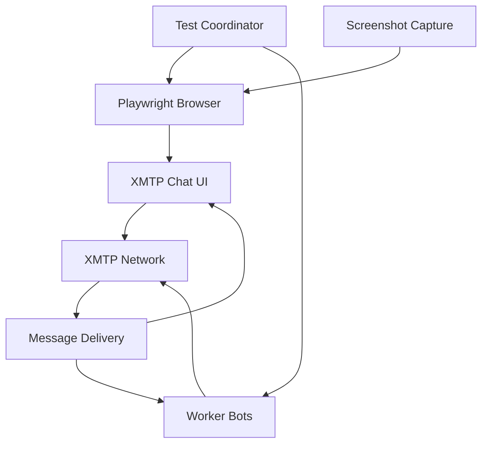

# Browser Testing Suite

This comprehensive test suite validates the XMTP Browser (xmtp.chat) functionality through automated end-to-end testing using Playwright. It ensures that the web interface correctly handles real-time messaging, group conversations, and user interactions in a production-like environment.

## Overview

The browser testing suite serves as a critical validation layer for the XMTP web application, testing the complete user journey from account creation to message delivery. It simulates real user interactions with the browser interface while coordinating with XMTP worker bots to create comprehensive messaging scenarios.

### Key Features

- **End-to-End Testing**: Complete user workflows from UI interaction to message delivery
- **Real-Time Validation**: Tests message streaming and real-time updates in the browser
- **Multi-User Scenarios**: Coordinates multiple browser instances and bot workers
- **Visual Debugging**: Automatic screenshot capture on test failures
- **Production Environment**: Tests against the live xmtp.chat application

## Architecture

### Components

1. **Playwright Automation** (`helpers/playwright.ts`)

   - Browser automation and UI interaction
   - Screenshot capture for debugging
   - Local storage management for wallet authentication
   - Message and conversation monitoring

2. **Worker Integration** (`@workers/manager`)

   - Backend XMTP client workers for message coordination
   - GM bot for automated responses
   - Conversation stream monitoring

3. **Inbox Management** (`@inboxes/utils`)
   - Pre-configured test accounts and identities
   - Random inbox selection for test isolation

### Test Flow Architecture



## Setup and Installation

```bash
# Clone the repository
git clone --depth=1 https://github.com/xmtp/xmtp-qa-tools
cd xmtp-qa-tools

# Install dependencies
yarn install

# Install Playwright browsers
npx playwright install chromium
```

### Environment Configuration

The tests require specific environment variables for proper operation:

```bash
# Set in .env file
XMTP_ENV=dev  # or production
GITHUB_ACTIONS=false  # Set to true in CI environment
```

## Test Scenarios

### 1. Group Invitation with Message

**Purpose**: Validates that group invitations are properly delivered when accompanied by an initial message.

**Flow**:

1. Worker bot creates a new group with random members
2. Bot adds the browser user to the group
3. Bot sends a greeting message to trigger notification
4. Browser waits for the group to appear in conversation list
5. Validates the group name matches expected format

```typescript
const newGroup = await creator.client.conversations.newGroup(
  getRandomInboxIds(4),
  {
    groupName: "Test Group 1 " + getTime(),
  },
);
await newGroup.addMembers([inbox.inboxId]);
await newGroup.send(`hi ${receiver}`);
const result = await xmtpTester.waitForNewConversation(newGroup.name);
```

### 2. Group Invitation without Message

**Purpose**: Tests group invitation delivery when no initial message is sent.

**Flow**:

1. Worker bot creates a new group
2. Bot adds the browser user without sending a message
3. Browser monitors for the silent group invitation
4. Validates the group appears in the conversation list

### 3. Direct Message Response Validation

**Purpose**: Tests DM creation through the UI and validates bot response functionality.

**Flow**:

1. Browser creates a new DM through the UI
2. Browser sends a message to trigger the GM bot
3. System waits for the automated "gm" response
4. Validates the response appears in the conversation

```typescript
await xmtpTester.newDmFromUI(gmBot.address);
await xmtpTester.sendMessage(`hi ${receiver}`);
const result = await xmtpTester.waitForResponse(["gm"]);
```

### 4. Group Creation via UI

**Purpose**: Tests complete group creation workflow through the browser interface.

**Flow**:

1. Browser navigates to group creation page
2. Adds multiple members including the GM bot
3. Creates the group through UI interactions
4. Sends a message to the group
5. Validates bot response within the group context

### 5. Asynchronous Member Addition

**Purpose**: Tests real-time updates when members are added to existing groups.

**Flow**:

1. Browser creates a group through the UI
2. Browser adds a new member (worker bot) to the group
3. Worker bot streams conversations to detect the new group
4. Validates the bot receives the group invitation in real-time

### 6. Multi-Instance Browser Testing

**Purpose**: Tests multiple browser sessions simultaneously.

**Flow**:

1. Creates a second Playwright browser instance
2. Performs independent messaging workflows
3. Validates isolation between browser sessions

## Playwright Helper Methods

### Browser Automation Methods

```typescript
// Navigation and setup
async startPage(): Promise<BrowserSession>
async takeSnapshot(name: string): Promise<void>

// Conversation management
async newDmFromUI(address: string): Promise<void>
async newGroupFromUI(addresses: string[]): Promise<string>
async addMemberToGroup(groupId: string, address: string): Promise<void>

// Messaging
async sendMessage(message: string): Promise<void>
async waitForResponse(expectedMessage: string[]): Promise<boolean>
async waitForNewConversation(groupName: string): Promise<boolean>
```

### Key Implementation Details

- **Headless Mode**: Automatically enabled in CI environments
- **Local Storage**: Manages wallet credentials and session data
- **Timeout Handling**: Configurable timeouts for message delivery
- **Error Recovery**: Screenshot capture on failures for debugging

## Configuration Options

### Playwright Options

```typescript
interface playwrightOptions {
  headless?: boolean; // Run browser in headless mode
  env?: XmtpEnv | null; // XMTP environment (dev/production)
  defaultUser?: {
    // Pre-configured user credentials
    walletKey: string;
    accountAddress: string;
    dbEncryptionKey: string;
    inboxId: string;
  };
}
```

### Worker Configuration

```typescript
// Conversation stream monitoring
const convoStreamBot = await getWorkers(["bob"]);
convoStreamBot.getAll().forEach((worker) => {
  worker.worker.startStream(typeofStream.Conversation);
});

// Message stream with GM responses
const gmBotWorker = await getWorkers([receiver]);
gmBotWorker.getAll().forEach((worker) => {
  worker.worker.startStream(typeofStream.MessageandResponse);
});
```

## Running Tests

### Local Development

```bash
# Run with visible browser (useful for debugging)
yarn test browser

# Run in headless mode
HEADLESS=true yarn test browser
```

### Debugging

```bash
# Enable debug output
DEBUG=1 yarn test browser

# Keep browser open after test completion
KEEP_BROWSER_OPEN=true yarn test browser
```

## Continuous Integration

### GitHub Actions Configuration

```yaml
name: Browser Tests
on:
  pull_request:
    branches: [main]
  schedule:
    - cron: "10 * * * *" # Hourly testing
  workflow_dispatch:

jobs:
  browser-tests:
    runs-on: ubuntu-latest
    steps:
      - uses: actions/checkout@v4
      - uses: actions/setup-node@v4
      - run: yarn install
      - run: npx playwright install chromium
      - run: yarn test browser
      - uses: actions/upload-artifact@v4
        if: failure()
        with:
          name: browser-test-artifacts
          path: |
            logs/screenshots/
            test-results/
```

### Monitoring and Alerts

- **Scheduled Runs**: Hourly execution to catch regressions quickly
- **Failure Artifacts**: Screenshots and logs automatically collected
- **Performance Metrics**: Response time and delivery tracking
