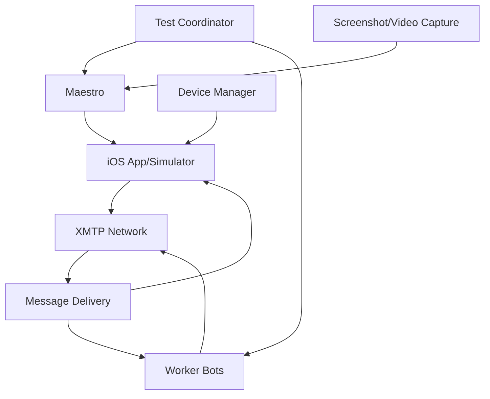

# IPA Testing Suite

This comprehensive test suite provides automated testing for React Native iOS applications (IPA files) using Maestro for UI automation, integrated with the XMTP worker framework for end-to-end messaging validation.

## Overview

The IPA testing suite enables automated testing of React Native mobile applications through device automation while coordinating with XMTP worker bots to create comprehensive messaging scenarios. It simulates real user interactions with the mobile app interface while validating message delivery, group operations, and real-time functionality.

### Key Features

- **Device Automation**: Complete mobile app workflows using Maestro
- **Real-Time Validation**: Tests message streaming and real-time updates in the mobile app
- **Multi-Device Scenarios**: Coordinates multiple devices/simulators and bot workers
- **Screenshot Capture**: Automatic screenshot capture on test failures
- **Performance Metrics**: Measures app performance and responsiveness
- **CI/CD Integration**: Supports both local development and continuous integration

## Architecture

### Components

1. **Maestro Automation** (`helpers/maestro.ts`)

   - Mobile app automation and UI interaction
   - Screenshot and video capture for debugging
   - App state management and navigation
   - Element detection and interaction

2. **Worker Integration** (`@workers/manager`)

   - Backend XMTP client workers for message coordination
   - GM bot for automated responses
   - Conversation stream monitoring

3. **Device Management** (`helpers/device.ts`)

   - iOS Simulator control
   - Physical device connection management
   - App installation and launch

4. **Inbox Management** (`@inboxes/utils`)
   - Pre-configured test accounts and identities
   - Random inbox selection for test isolation

### Test Flow Architecture



## Setup and Installation

### Prerequisites

1. **macOS** (required for iOS testing)
2. **Xcode** with iOS Simulator
3. **Maestro CLI**
4. **Node.js** 20+
5. **Your IPA file**

### Installation Steps

```bash
# Install Maestro CLI
curl -Ls "https://get.maestro.mobile.dev" | bash
export PATH="$PATH":"$HOME/.maestro/bin"

# Verify Maestro installation
maestro --version

# Install iOS Simulator (if not already installed)
# This is typically included with Xcode

# Clone and setup the repository
git clone --depth=1 https://github.com/xmtp/xmtp-qa-tools
cd xmtp-qa-tools
yarn install
```

### Environment Configuration

```bash
# Set in .env file
XMTP_ENV=dev  # or production
IPA_PATH=/path/to/your/app.ipa
IOS_SIMULATOR_UDID=your-simulator-udid  # Optional: specific simulator
IOS_DEVICE_UDID=your-device-udid        # Optional: specific physical device
MAESTRO_DEBUG=true                      # Enable debug logging
```

### IPA Setup

```bash
# Place your IPA file in the project
mkdir -p suites/mobile/ipa/apps
cp /path/to/your/app.ipa suites/mobile/ipa/apps/

# Or set the path in environment
export IPA_PATH=/path/to/your/app.ipa
```

## Test Scenarios

### 1. App Launch and Authentication

**Purpose**: Validates app startup and user authentication flow.

**Flow**:

1. Install and launch the IPA on simulator/device
2. Navigate through onboarding screens
3. Complete authentication (wallet connection, etc.)
4. Verify app reaches main conversation screen

### 2. Direct Message Creation and Delivery

**Purpose**: Tests DM creation through the mobile UI and validates message delivery.

**Flow**:

1. Create a new DM through the mobile app UI
2. Send a message to trigger worker bot response
3. Wait for the automated response from GM bot
4. Validate the response appears in the conversation

### 3. Group Creation and Management

**Purpose**: Tests complete group creation workflow through the mobile interface.

**Flow**:

1. Navigate to group creation in the mobile app
2. Add multiple members including worker bots
3. Create the group through UI interactions
4. Send messages to the group
5. Validate bot responses within the group context

### 4. Real-time Message Streaming

**Purpose**: Tests real-time message delivery and UI updates.

**Flow**:

1. Worker bot sends messages to the mobile app user
2. Mobile app receives and displays messages in real-time
3. Validates message order and delivery timestamps
4. Tests scroll behavior and message rendering

### 5. Group Invitation Handling

**Purpose**: Tests group invitation delivery and acceptance.

**Flow**:

1. Worker bot creates a group and invites mobile app user
2. Mobile app receives the group invitation
3. User accepts invitation through mobile UI
4. Validates group appears in conversation list

### 6. Push Notification Testing

**Purpose**: Tests push notification delivery and handling.

**Flow**:

1. App goes to background
2. Worker bot sends message
3. Push notification appears
4. Tap notification opens correct conversation

## Maestro Helper Methods

### App Control Methods

```typescript
// App lifecycle
async installApp(ipaPath: string): Promise<void>
async launchApp(bundleId: string): Promise<void>
async backgroundApp(): Promise<void>
async foregroundApp(): Promise<void>
async terminateApp(): Promise<void>

// Navigation and interaction
async tapElement(selector: string): Promise<void>
async typeText(text: string): Promise<void>
async scrollTo(direction: 'up' | 'down' | 'left' | 'right'): Promise<void>
async waitForElement(selector: string, timeout?: number): Promise<void>

// Validation
async takeScreenshot(name: string): Promise<void>
async recordVideo(name: string): Promise<void>
async assertElementExists(selector: string): Promise<void>
async assertElementText(selector: string, expectedText: string): Promise<void>
```

### Device Management Methods

```typescript
// Simulator control
async startSimulator(udid?: string): Promise<string>
async stopSimulator(udid: string): Promise<void>
async resetSimulator(udid: string): Promise<void>

// Device management
async getConnectedDevices(): Promise<Device[]>
async selectDevice(udid: string): Promise<void>
async installAppOnDevice(ipaPath: string, udid: string): Promise<void>
```

## Configuration Options

### Maestro Configuration

```yaml
# maestro.yaml
appId: com.yourcompany.yourapp
flows:
  - appLaunch.yaml
  - authentication.yaml
  - messaging.yaml
  - groups.yaml

env:
  DEBUG: true
  TIMEOUT: 30000
  SCREENSHOT_ON_FAILURE: true
```

### Device Configuration

```typescript
interface DeviceConfig {
  type: "simulator" | "device";
  udid?: string;
  platform: "iOS";
  platformVersion?: string;
  deviceType?: string; // iPhone 15 Pro, iPad Pro, etc.
}
```

### Test Configuration

```typescript
interface IPATestConfig {
  ipaPath: string;
  bundleId: string;
  device: DeviceConfig;
  maestroConfig: {
    timeout: number;
    screenshotOnFailure: boolean;
    videoRecording: boolean;
  };
  xmtp: {
    env: "dev" | "production";
    workers: string[];
  };
}
```

## Maestro Flow Files

### Basic App Launch Flow (`flows/appLaunch.yaml`)

```yaml
appId: com.yourcompany.yourapp
---
- launchApp
- assertVisible: "Welcome"
- tapOn: "Get Started"
- assertVisible: "Connect Wallet"
```

### Authentication Flow (`flows/authentication.yaml`)

```yaml
appId: com.yourcompany.yourapp
---
- tapOn: "Connect Wallet"
- tapOn: "MetaMask"
- assertVisible: "MetaMask"
- tapOn: "Connect"
- assertVisible: "Conversations"
```

### Messaging Flow (`flows/messaging.yaml`)

```yaml
appId: com.yourcompany.yourapp
---
- tapOn: "New Message"
- inputText: "${RECIPIENT_ADDRESS}"
- tapOn: "Start Chat"
- inputText: "Hello from mobile test!"
- tapOn: "Send"
- assertVisible: "Hello from mobile test!"
```

## Running Tests

### Local Development

```bash
# Run with iOS Simulator
yarn test ipa

# Run on specific simulator
IOS_SIMULATOR_UDID=your-udid yarn test ipa

# Run on physical device
IOS_DEVICE_UDID=your-udid yarn test ipa

# Run with debug output
MAESTRO_DEBUG=true yarn test ipa
```

### Debug Mode

```bash
# Enable Maestro studio for interactive testing
maestro studio

# Run with video recording
VIDEO_RECORDING=true yarn test ipa

# Keep app running after test
KEEP_APP_RUNNING=true yarn test ipa
```

## Test Structure

### Directory Layout

```
suites/mobile/ipa/
├── README.md              # This file
├── ipa.test.ts            # Main test file
├── apps/                  # IPA files storage
│   └── your-app.ipa
├── flows/                 # Maestro flow files
│   ├── appLaunch.yaml
│   ├── authentication.yaml
│   ├── messaging.yaml
│   └── groups.yaml
├── helpers/               # Helper utilities
│   ├── maestro.ts
│   ├── device.ts
│   └── ipa-manager.ts
└── config/               # Configuration files
    ├── maestro.yaml
    └── devices.json
```

### Test Implementation Pattern

```typescript
import { getWorkersWithVersions } from "@helpers/client";
import { logError } from "@helpers/logger";
import { setupTestLifecycle } from "@helpers/vitest";
import { getWorkers } from "@workers/manager";
import { describe, expect, it } from "vitest";
import { DeviceManager } from "./helpers/device";
import { MaestroHelper } from "./helpers/maestro";

const testName = "ipa-messaging";

describe(testName, async () => {
  const workers = await getWorkers(
    getWorkersWithVersions(["alice", "bob"]),
    testName,
  );

  const maestro = new MaestroHelper();
  const deviceManager = new DeviceManager();

  setupTestLifecycle({
    testName,
    expect,
  });

  it("should send and receive messages", async () => {
    try {
      // Setup device and install app
      const device = await deviceManager.startSimulator();
      await maestro.installApp(process.env.IPA_PATH);
      await maestro.launchApp();

      // Authenticate user
      await maestro.runFlow("authentication.yaml");

      // Test messaging
      const alice = workers.get("alice");
      await maestro.createDM(alice.address);
      await maestro.sendMessage("Hello from mobile!");

      // Validate message delivery
      await maestro.waitForMessage("Hello from mobile!");
    } catch (e) {
      await maestro.takeScreenshot("failure");
      logError(e, expect.getState().currentTestName);
      throw e;
    }
  });
});
```

## Continuous Integration

### GitHub Actions Configuration

```yaml
name: IPA Tests
on:
  pull_request:
    branches: [main]
  schedule:
    - cron: "0 */6 * * *" # Every 6 hours
  workflow_dispatch:

jobs:
  ipa-tests:
    runs-on: macos-latest
    steps:
      - uses: actions/checkout@v4
      - uses: actions/setup-node@v4
      - run: yarn install

      # Install Maestro
      - run: |
          curl -Ls "https://get.maestro.mobile.dev" | bash
          echo "$HOME/.maestro/bin" >> $GITHUB_PATH

      # Setup iOS Simulator
      - run: |
          xcrun simctl create test-device com.apple.CoreSimulator.SimDeviceType.iPhone-15-Pro com.apple.CoreSimulator.SimRuntime.iOS-17-0

      - run: yarn test ipa
        env:
          IPA_PATH: ${{ secrets.IPA_PATH }}
          XMTP_ENV: production

      - uses: actions/upload-artifact@v4
        if: failure()
        with:
          name: ipa-test-artifacts
          path: |
            logs/screenshots/
            logs/videos/
            test-results/
```

## Performance Monitoring

### Metrics Collected

- **App Launch Time**: Time from tap to main screen
- **Message Send Time**: Time from send tap to message appears
- **Message Receive Time**: Time from external message to display
- **Navigation Speed**: Time between screen transitions
- **Memory Usage**: App memory consumption during tests
- **CPU Usage**: App CPU usage during operations

### Performance Assertions

```typescript
// Performance-aware test assertions
expect(appLaunchTime).toBeLessThan(3000); // 3 seconds
expect(messageSendTime).toBeLessThan(1000); // 1 second
expect(navigationTime).toBeLessThan(500); // 500ms
```

## Troubleshooting

### Common Issues

1. **App Installation Failures**

   - Verify IPA file is valid and not corrupted
   - Check provisioning profile and certificates
   - Ensure device/simulator compatibility

2. **Element Detection Issues**

   - Use Maestro Studio to inspect app elements
   - Verify accessibility labels are present
   - Update selectors in flow files

3. **Simulator/Device Connection**

   - Reset iOS Simulator if unresponsive
   - Check physical device is unlocked and trusted
   - Verify device UDID is correct

4. **Network Connectivity**
   - Ensure simulator/device has internet access
   - Check XMTP environment endpoints are reachable
   - Verify firewall settings

### Debug Commands

```bash
# List available simulators
xcrun simctl list devices

# Check Maestro connection
maestro test --help

# Reset simulator
xcrun simctl erase all

# View device logs
xcrun simctl spawn booted log stream
```

## Best Practices

1. **Test Isolation**: Each test should be independent and clean up after itself
2. **Element Stability**: Use stable selectors (accessibility IDs when possible)
3. **Wait Strategies**: Always wait for elements before interacting
4. **Error Handling**: Capture screenshots/videos on failures
5. **Performance**: Balance test coverage with execution time
6. **Data Management**: Use fresh test data for each run
7. **Device Management**: Clean up simulators/apps between test runs

## Integration with XMTP Framework

The IPA testing suite integrates seamlessly with the existing XMTP testing framework:

- Uses the same worker management system
- Leverages existing inbox generation utilities
- Follows the same error handling and logging patterns
- Integrates with the CLI testing interface
- Supports the same environment management (dev/production)

This ensures consistency across all testing suites while providing specialized mobile app testing capabilities.
